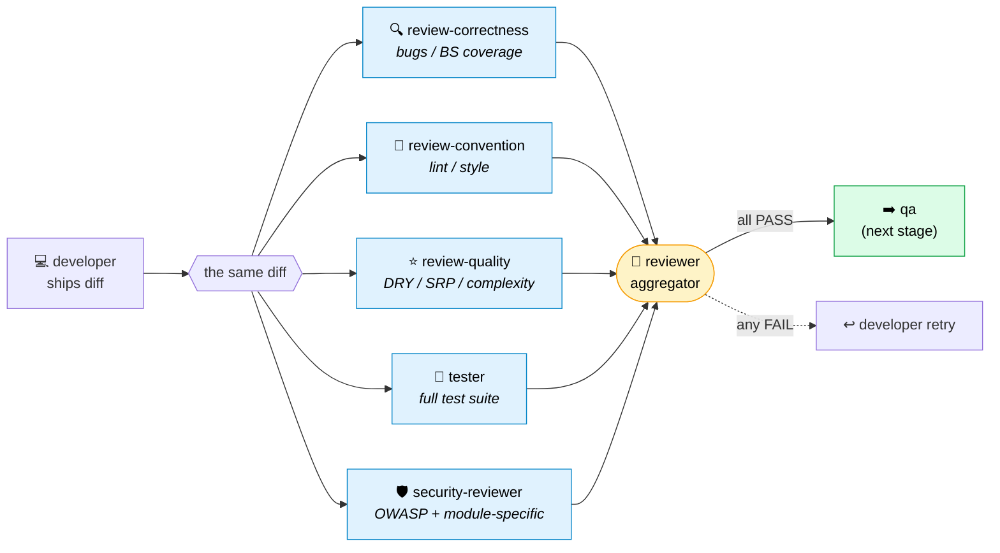

<div align="center">

# 🤖 AI Pipeline Cookbook

### Plain English in. A reviewed, tested, security-scanned PR out.

**One CLI command. 13 Claude agents. 5-way parallel review. Filesystem state. No black box.**

[](LICENSE)
[](tests/)
[](pipeline-workflow.md)
[](pipeline-workflow.md)

*A cookbook of patterns for a production-grade multi-agent dev pipeline — assembled from many months of running one.*

</div>

---

## What is this?

> **Cookbook of patterns, not a framework.** Read it. Copy what fits. Ship something different.

Take a plain-English task. Hand it to a 13-agent assembly line. Get a reviewed, tested, security-scanned, documented PR back. Three configurable human gates let humans intercept where the cost is lowest — not where it's loudest.

The whole pipeline lives in a directory. State is a few JSON files. There is no message queue, no in-process magic, no "agent OS." `cat meta.json` and you can see what the team is doing. That's the design.

> 📖 **Spec lives in [`pipeline-workflow.md`](pipeline-workflow.md).** Mermaid flowchart, full state machine, retry semantics, 3-gate human review, Slack matrix, tracker-driven adaptations. The blog posts tell stories. That file *is* the spec.

### What ships in the cookbook vs. what you tune yourself

The cookbook **runs out of the box** — daemon, 14 agent prompts, 4 module profiles, 9 user-facing skills, the slack hook, the state machine, the production-validated tunings (T1–T19 in `pipeline-workflow.md`). What's left for you is project-specific glue: tracker adapter, profile values for your stack, the agent prompts adapted to your conventions.

| Aspect | Shipped in this repo (run-ready) | What you tune for your project |
|---|---|---|
| 13-agent assembly line + optional weekly tuner | ✓ All 14 prompts under `.claude/agents/*.md` | Your project's coding conventions, common pitfalls, module-specific gotchas appended into each prompt |
| Parallel review fan-out (3 reviewers + tester + security) | ✓ Daemon's barrier orchestrator (`pipeline-daemon.py`) | Risk-tier rules per module (when to skip sub-reviewers on S/typo tasks) |
| Sprint Contract pattern | ✓ `architect.md` produces it; `docs/blog/sprint-contract.md` explains why | Manifesto axes specific to your stack (perf, thread-safety, observability) |
| Idempotency + retry caps | ✓ `role_done` guard in every agent prompt; `MAX_RETRIES`, `MAX_ARCHITECT_REVISIONS=2` in the daemon | Per-task overrides via `meta.json.max_retries` |
| Three configurable human gates (`Awaiting Info` / `Code Review` / `Final Test`) | ✓ Marker-file mechanism in the local daemon; full reference in [`pipeline-workflow.md`](pipeline-workflow.md) | How you wire each gate into Slack / tracker / UI for production |
| File-state machine (`.state/`) | ✓ The full daemon ships in-tree (`pipeline-daemon.py`, ~2200 LOC) | Optional — swap to tracker-as-state-machine for production (see use-case doc) |
| Cost & timeout discipline | ✓ Per-role timeouts (T4), per-role output caps (T7), cache-aware billable counter, daily USD cap, quota-reset regex (T13) | Override per-role caps via `LSD_AGENT_TIMEOUT_<ROLE>` / `LSD_MAX_OUTPUT_<ROLE>` env vars |
| Slack notification matrix (11 event types) | ✓ `notify-slack.py` hook + integration in the daemon | `PIPELINE_SLACK_BOT_TOKEN` / `PIPELINE_SLACK_CHANNEL` env vars; channel choice |
| Tracker-driven production mode (Jira / Linear / GitHub Issues + Slack live tail) | ✓ Reference doc + Mermaid flow in [`docs/use-case-tracker-driven-pipeline.md`](docs/use-case-tracker-driven-pipeline.md) | The tracker poll/post adapter (your tracker, your auth, your custom-field schema) |

The cookbook ships a **working starter daemon** (`.claude/scripts/pipeline-daemon.py`) and CLI (`team.sh`) so you can run the assembly line out of the box. Treat them as a reference implementation — every team ends up tuning the daemon for its tracker, language stack, risk tolerance, and cost budget. The patterns are stable; the wiring is yours to evolve.

The pattern is described in terms of Claude Code because that's what the maintainers run, but it's **LLM-agnostic in shape**: the daemon, profiles, and `.state/` machine don't depend on Claude Code specifics, and the agent prompt format is portable to any system that can drive a markdown-prompted subagent. Swap the runner, keep the assembly line.

---

## Who this is for

> **Not a beginner's tutorial.** Better to know on line 1 than on day 3.

**At home here:**
- Tried LangChain / CrewAI / AutoGen / LangGraph (or rolled your own) and decided *"one prompt does not ship features."*
- Shipped real software with real CI, real reviews, real on-call. Want your AI pipeline to look like that.
- Read *"5 reviewers in parallel against the same diff"* and thought *"yes, finally."* — not *"isn't that overkill?"*
- Not on Claude Code. The runner is a single subprocess line; swapping it for another LLM CLI is roughly a one-line change. Agents, state machine, profiles, Sprint Contract — runner-agnostic.
- Prefer an opinionated cookbook over a *"build an AI agent in 5 minutes"* tutorial.

**Wrong fit if:**
- You want a 5-minute tutorial. This is a *system*.
- You want one prompt to copy-paste. Doesn't ship.
- You expect a hosted UI / dashboard. Not here.

---

## The pipeline

```
                        team.sh start "<task>"
                                │
                                ▼
                          ┌──────────┐
                          │ planner  │  Sonnet — splits task into sub-tasks,
                          └────┬─────┘  builds DAG, writes active.json
                               │
                               ▼
                          ┌──────────┐
                          │ analyst  │  Opus — requirements + edge cases +
                          └────┬─────┘  Behavioral Spec (BS-1, BS-2, ...)
                               │
                               ▼
                          ┌──────────┐
                          │architect │  Opus — Sprint Contract: API/schema/
                          └────┬─────┘  SPI/manifest. The single source of truth
                               │        downstream agents are graded against.
                               ▼
                          ┌──────────┐
                          │developer │  Opus — implements code. Up to 3
                          └────┬─────┘  retries if review/test/qa fails.
                               │
                               ▼  spawns 5 subprocesses in parallel against the diff:
              ┌────────────────────────────────────────────┐
              │  review-correctness   (Opus)               │
              │  review-convention    (Sonnet)             │   ← 5-way fan-out,
              │  review-quality       (Sonnet)             │     same diff
              │  tester               (Sonnet)             │
              │  security-reviewer    (Opus)               │
              └─────────────────────┬──────────────────────┘
                                    │  daemon barrier — waits for all 5
                                    ▼
                          ┌──────────┐
                          │ reviewer │  Sonnet — aggregates the 5 verdicts.
                          └────┬─────┘  any FAIL → developer retries (max 3)
                               │
                               ▼
                          ┌──────────┐
                          │    qa    │  Opus — E2E + smoke + UX. Final
                          └────┬─────┘  human-style sanity check.
                               │
                               ▼
                          ┌──────────┐
                          │documenter│  Sonnet — updates API contracts +
                          └────┬─────┘  CHANGELOG
                               │
                               ▼
                          ┌──────────┐
                          │retrospec │  Sonnet — appends to
                          └────┬─────┘  learned-lessons/<module>.md
                               │
                               ▼
                              done
                  (moved to completed.jsonl)
```

Status state machine:

```
queued → analyzing → analyzed → designing → designed → developing → developed
       → reviewing (reviewer + tester + security in parallel)
       → reviewed | review_failed (→ developer retry, max 3)
       → qa-checking → qa_passed | qa_failed (→ developer retry, max 2)
       → documenting → documented → retrospecting → done
```

---

## Why this design?

Five things make this pipeline production-grade rather than a fancy demo:

### 1. The filesystem is the state machine — `cat`, `grep`, `git diff` are your debugger

Most AI pipelines invent state engines, message queues, or run everything in-process. This design does none of that. The whole pipeline lives in a single directory:

```
.state/
├── active.json                       # the DAG: what's queued, in flight, blocked
├── completed.jsonl                   # append-only outcome log
├── locks/team.lock                   # daemon pid; prevents two daemons
└── tasks/<task-id>/
    ├── meta.json                     # status + role_done flags + retry counts
    ├── analysis.md                   # analyst output
    ├── design.md                     # architect output (Sprint Contract)
    ├── progress.md                   # developer output
    ├── reviews/{correctness,convention,quality,security}.json
    ├── tests.md                      # tester output
    ├── qa.md                         # qa output
    ├── docs.md                       # documenter output
    └── handoffs.jsonl                # inter-agent messages
```

`meta.json.status` is the dial. `meta.json.role_done.<role>` is **idempotency**: if the daemon restarts mid-pipeline, every agent that's already finished sees its flag and exits in 50 ms. Nothing re-runs. Nothing duplicates.

You can `cat meta.json` and read what the team is doing. You can `tail -f handoffs.jsonl` and watch the conversation. You can `git diff .state/` and review what the AI just decided. **No black box.**

### 2. Upstream errors compound — so upstream gets the bigger model

Every downstream agent inherits the upstream's mistakes. Wrong edge case → wrong spec → wrong feature → rubber-stamped. By stage 8, you've stacked 7 layers of "close enough."

**Opus on upstream + security-critical roles. Sonnet on structured downstream roles.** Cheap models compound errors faster than they save dollars.

| Role | Model | Why |
|---|---|---|
| `analyst`, `architect`, `developer`, `qa`, `security-reviewer` | Opus | Upstream errors are catastrophic; security findings need real reasoning |
| `review-correctness` | Opus | Catches the bugs that matter |
| `planner`, `reviewer`, `review-convention`, `review-quality`, `tester`, `documenter`, `retrospective` | Sonnet | Structured pattern matching; clear inputs and outputs |

### 3. The Sprint Contract is the rubric — not a design doc

**Rename your `design.md` to `Sprint Contract` and the architect's posture changes.** Not "I'm sketching ideas." It's "I'm writing the spec everyone else gets graded against."

Concretely: typed API surfaces, schema deltas as `ALTER TABLE` lines, a 4-axis manifest check (perf / thread-safety / safety / observability), numbered Behavioral Spec (`BS-1`, `BS-2`, …), Sprint Contract invariants (`REQ-1`, `REQ-2`, …). Every downstream prompt cites the contract by section. Diff doesn't match? Developer retries — not the contract.

> Full pattern, anatomy, anti-pattern war story: [`docs/blog/sprint-contract.md`](docs/blog/sprint-contract.md). **If only one thing from this cookbook sticks, make it this one.**

### 4. Review is a 5-way fan-out — no groupthink, no first-mover bias

One "review my code" prompt is a coin flip. It catches whatever the reviewer notices first; the rest slip through.

So when the developer ships, the daemon spawns **five independent Claude subprocesses at the same time** against the same diff:

- **`review-correctness`** (Opus) — bugs, missing edge cases, BS coverage
- **`review-convention`** (Sonnet) — lint / format / style violations
- **`review-quality`** (Sonnet) — DRY, SRP, complexity, dead code
- **`tester`** (Sonnet) — runs the actual test suite
- **`security-reviewer`** (Opus) — OWASP + module-specific checks

They don't talk to each other — that's deliberate. No groupthink, no *"the first reviewer said it's fine, I'll skip"*. An orchestrator (`reviewer`) waits for all five, aggregates the verdict, and either passes the task to QA or hands it back to the developer with the blocking findings.



What this looks like on disk while it's running — five rows in `team.sh status`, same task ID, five different OWNERs:

```
Active Tasks (1):
ID                       MODULE      STATUS      OWNER                UPTIME
20260427-1432-hlt        backend     reviewing   review-correctness   0:01:23
20260427-1432-hlt        backend     reviewing   review-convention    0:01:23
20260427-1432-hlt        backend     reviewing   review-quality       0:01:23
20260427-1432-hlt        backend     reviewing   tester               0:01:23
20260427-1432-hlt        backend     reviewing   security_reviewer    0:01:23
```

### 5. The feedback loop closes itself — propose-only tuner + 3-gate human review

**Agents handle volume. Humans handle judgement. The system gets better at being itself between sprints.**

Two failure modes would otherwise rot a multi-agent pipeline:

- **Lessons learned but never re-applied.** The retrospective writes a `learned-lessons/<module>.md` entry after every closed task. Without anyone reading them, the file becomes a graveyard. The 14th agent — `tuner`, on a **weekly cron** — distills the week's lessons into *one* targeted prompt patch and drops it under `.state/tuner/<week>/proposal.md` for human approval. **The tuner can identify and articulate. The human decides.** It can't apply on its own. That constraint *is* the design. ([`docs/blog/the-tuner-pattern.md`](docs/blog/the-tuner-pattern.md))
- **Agents shipping things humans didn't ask for.** Three configurable human gates intercept the same mistake at three costs:
  - **`Awaiting Info`** — analyst/architect surfaced an open decision. **30s reply.**
  - **`Human Code Review`** — post-reviewer-barrier; mandatory for `flow_type=code_development`. **90s skim.**
  - **`Human Final Test`** — post-staging push; optional in local mode. **Minutes for a smoke pass.**

Earlier gates buy bigger corrections. ([`pipeline-workflow.md`](pipeline-workflow.md))

---

## Getting started

```bash
git clone https://github.com/<your-org>/agentnizer-cookbook
cd agentnizer-cookbook
chmod +x team.sh
./team.sh help
```

Then either:

**Read-only walkthrough** (no agent spawn, ~5 min) — open `examples/quickstart/README.md` and inspect `task.txt`, `profiles/demo.yaml`, and the mocked `expected-output/` artifacts to see what each role produces.

**Live run** (spawns real Claude agents, billed) — once you've reviewed the quickstart:

```bash
./team.sh start "$(cat examples/quickstart/task.txt)"
./team.sh status              # watch the assembly line progress
./team.sh logs --daemon       # tail the daemon log
```

You'll need:
- [Claude Code](https://docs.claude.com/claude-code) installed and authenticated (`claude --version` should work).
- Python 3.10+ on `PATH` (the daemon is `.claude/scripts/pipeline-daemon.py`).
- Bash 4+ (`brew install bash` on macOS).
- `jq` is optional — the daemon falls back to a Python JSON parser if it's missing.

The starter daemon is intentionally small (~2k LOC) and dependency-free aside from the Python standard library plus `claude-code` itself. Read it, fork it, ship something different.

---

## Reference layout (build this in your own repo)

The layout below is the convention every recipe in this cookbook assumes. Put it in your own repo when you assemble your pipeline.

```
your-repo/
├── team.sh                          # CLI: start / stop / status / pause / logs
├── .state/                          # runtime state (gitignored except README)
│   ├── README.md                    # schema documentation
│   ├── active.json
│   ├── completed.jsonl
│   ├── locks/
│   └── tasks/<task-id>/...
├── pipeline-workflow.md             # deep technical reference (Mermaid + ASCII + state machine + tunings)
└── .claude/
    │
    ├── agents/                      # 14 agent definitions
    │   ├── planner.md
    │   ├── analyst.md
    │   ├── architect.md
    │   ├── developer.md
    │   ├── reviewer.md              # orchestrator — spawns 3 sub-reviews
    │   ├── review-correctness.md
    │   ├── review-convention.md
    │   ├── review-quality.md
    │   ├── tester.md
    │   ├── qa.md
    │   ├── security-reviewer.md
    │   ├── documenter.md
    │   ├── retrospective.md
    │   └── tuner.md                 # weekly cron — proposes prompt patches
    │
    ├── skills/                      # user-invocable slash commands
    │   ├── start/SKILL.md           # /start "<task>" → team.sh start
    │   ├── status/SKILL.md          # /status → team.sh status
    │   ├── feature/SKILL.md         # /feature "<desc>" → start with feature template
    │   ├── bugfix/SKILL.md          # /bugfix "<desc>" → hypothesis-first bug task
    │   └── ...                      # ask, verify, improve, local-loop, process-issues
    │
    ├── hooks/
    │   ├── after-code-change.sh     # PostToolUse: module detect + warnings
    │   ├── check-status-update.sh   # Stop: nudge to update STATUS.md
    │   └── notify-slack.py          # optional — Slack notify (used minimally)
    │
    ├── scripts/
    │   └── pipeline-daemon.py       # the LSD (Local State Daemon)
    │
    ├── profiles/                    # per-module build/test/manifest config
    │   ├── shared.yaml               # cross-cutting library
    │   ├── backend.yaml              # API server example
    │   ├── worker.yaml               # background-job example
    │   └── frontend.yaml             # UI example
    │
    └── learned-lessons/             # retrospective writes here
        ├── shared-lessons.md
        ├── worker-lessons.md
        └── ...
```

Each recipe (`examples/bug-fix/`, `examples/new-feature/`, `examples/tracker-adapter/`) shows what the inputs and the expected outputs look like for that layout.

---

## Production adaptations

The cookbook describes a fully local example because it's the simplest thing that actually works. But the architecture has clean seams for production scaling. **None of this is required to run the patterns**, but here's how to extend them:

### Make a tracker (Jira / Linear / GitHub Issues / ...) the state machine

Short version:

```
issue.status              ↔ meta.json.status
issue.labels              ↔ meta.json.role_done flags (e.g. "ai-developed")
issue.comments            ↔ analysis.md / design.md / progress.md (one comment per agent)
custom field "module"     ↔ meta.json.module
```

**The daemon's poll loop becomes a tracker poll.** Instead of reading `active.json`, query the tracker for *"open issues with label `ai-pipeline` whose status is one I handle"*. Instead of writing files, post comments and transition statuses. Agent prompts don't change — they still read structured input, write structured output.

For the long version — a full diagrammed reference of what a tracker-driven shape *can* look like (status flow, decomposition, retry loops, run modes, the parts deliberately *not* shown) — see:

> 📄 **[`docs/use-case-tracker-driven-pipeline.md`](docs/use-case-tracker-driven-pipeline.md)**

That document is a sketched composite, not a working module. Read its disclaimer first.

### Use Slack for action-required gates

The local example sends Slack messages only on critical events (security alert, retry-limit, task failure) — `notify-slack.py` is a fire-and-forget hook called from the daemon. In production, you can dial it up to make Slack the team's live ops view (full event matrix in [`pipeline-workflow.md`](pipeline-workflow.md)):

- **Awaiting Info**: when the analyst or architect surfaces an open decision, post the question to Slack with the unresolved items inlined. Reply resolves the gate. The cheapest correction in the pipeline — 30s of human time saves a developer cycle of building the wrong thing.
- **Human Code Review**: after the reviewer barrier passes, post the diff + Sprint Contract summary to Slack. *"Reply 👍 to approve, ❌ + reason to reject"*. Mandatory for `flow_type=code_development`.
- **Human Final Test**: after CI/CD push, ping QA-on-duty with the staging URL or build artifact. Optional in local mode (no staging); turn it on once you have one.
- **Security alerts**: keep these unconditional, even in dev — a CRITICAL OWASP finding shouldn't wait for someone to look at a dashboard.
- **`phase_transition`**: every status change becomes a one-liner in the channel. Engineers read the channel instead of polling `team.sh status`. Audit trail is free.

### Scale beyond one machine

A single-host daemon runs one daemon per repo. To scale:
- Move `.state/` to NFS or S3-FUSE so multiple daemons share state.
- Use a database (Postgres + `SELECT FOR UPDATE SKIP LOCKED`) instead of `active.json` for the queue.
- Lift the daemon's `acquire_lock()` to a distributed lock (Postgres advisory lock, Redis SETNX, ZooKeeper).

The agent prompts still don't change.

---

## A note on benchmarks (shapes, not averages)

The cookbook claims "production-grade" without a single bold "X% faster" headline. That's deliberate. The metrics that matter (retry rate, token cost, time-to-PR) are **wildly task-dependent** — a 2-file refactor and a 6-file feature aren't the same number; a `[CRITICAL]`-risk module and a `[LOW]` module aren't the same number; a clean spec at triage and a fuzzy one aren't the same number. Averaging across them produces a figure that looks authoritative and isn't.

A statistically clean baseline still doesn't exist. But after running the production version (the cookbook's parent project) for a stretch, **shapes are starting to emerge** — and shapes are honest in a way averages are not. Some that have held up across roughly 60 completed tasks across 4 modules (~5M tokens, ~$4.60 of API spend total):

- **Prompt cache dominates total token volume.** ≈88% of all input tokens are `cache_read`, ≈7% are `cache_creation`, ≈1% are fresh `output`, the rest is fresh `input`. The Sprint Contract pattern + role-stable prompt prefix (T8) is what keeps cache hit rate that high; without it the cost number would be roughly **8–10× higher** at the same token count.
- **Cost-per-task spans roughly two orders of magnitude.** Trivial tasks (lint fix, doc-only change) settle around $0.0X; complex multi-module features land around $1+. Anything in between is in between. Don't let the average fool you — both ends are normal.
- **QA and tester are the heaviest single-call consumers.** Per call, `qa` and `tester` typically each spend more than `developer` (which produces the biggest *diff*). Reason: both run end-to-end / full-suite work that loads more context. If you're worried about cost, target boilerplate trimming there first (T7 `AGENT_MAX_OUTPUT_PER_ROLE` was tuned with this evidence).
- **Opus/Sonnet split holds.** Opus on producer roles (analyst, architect, developer) ends up around ⅔ of total cost despite roughly 50/50 cache-read share; Sonnet on orchestration/review/qa carries roughly ⅓. The split lands close to a typical "you'd want to pay more for the few decisions that compound" intuition without anyone having to enforce it.
- **Retry-rate is the canary, not the average cost.** When a module's `developer→reviewer` retry rate climbs from baseline (single-digit %) to double-digit, the architect's designs are slipping for that module — not the developer. Cumulative retries are visible in `retry_count.<role>` on every `completed.jsonl` row; track them as a histogram per module.

**These numbers will shift with your context.** Codebase size, language stack, average task complexity, manifesto strictness, model mix, prompt-cache TTL, retry caps — every one of them moves the figures above. Take the *shapes* (cache dominance, two-orders-of-magnitude task spread, qa/tester being the per-call peaks, Opus producer share, retry-rate as the canary) and expect the *exact* numbers to land somewhere near or far from ours depending on how your repo and team look. The shapes are the durable part; the numbers are a snapshot.

> ⚠ **One setting is not negotiable: set the hard caps.** We've had bug-and-loop runs — same retry, same gate, the meter climbing silently every cycle — that only stopped when the daemon's hard token / dollar cap kicked the task offline. Production-grade or not, the meter can run away on a single bad task. `meta.json.token_budget.hard_limit` per-task and `LSD_DAILY_USD_HARD_CAP` daemon-wide aren't optional knobs; they're the safety floor. Ship them set.

When stricter numbers ship, they'll come with the task distribution behind them, the manifesto-axis breakdown, and the retry-rate histogram — not just a headline. Until then, run the [quickstart](examples/quickstart/README.md) on your own codebase, watch the shapes above against your runs, and trust your own measurements over anyone else's.

---

## Real-world lessons (from running the production version)

> Each one is a war story. None of them are theoretical.

**Triage is spec-first. Nothing ambiguous leaves.**
*"Make login better"* sounds like a task. It isn't. Everything downstream compounds whatever fuzziness survives triage. Either the task becomes a spec (concrete inputs, outputs, acceptance criteria, named modules, complexity classified) or it goes to `awaiting_info`. 90 seconds of clarity saves a developer-retry later.

**Earlier gates are cheaper gates.**
30 seconds at `Awaiting Info` buys what 90 seconds at `Human Code Review` buys what minutes at `Human Final Test` buys. Same mistake intercepted, wildly different cost. Spend human attention as early as the gate semantics allow.

**Retry rate is the canary. The tuner closes the loop.**
When a module's `developer→reviewer` retry rate climbs single-digit → double-digit, the architect's designs are slipping — not the developer. The weekly tuner reads `learned-lessons/<module>-lessons.md`, finds patterns across 2+ tasks, and drops a proposed prompt patch for human approval. You write `approved` or `rejected` Monday morning. The pipeline gets better at being itself.

**Hard caps before benchmarks. Non-negotiable.**
We've had bug-and-loop runs where the meter ran away silently — same retry, same gate, every cycle — until the daemon's hard cap kicked it offline. `meta.json.token_budget.hard_limit` per-task and `LSD_DAILY_USD_HARD_CAP` daemon-wide aren't optional knobs. Ship them set.

**The DAG is real. Module-conflict guard is non-optional.**
Decompose a task into 5 parallel sub-tasks and the daemon really does run them in parallel up to the cap — a 3× speedup on parallelizable work. The module-conflict guard prevents two sub-tasks in the same module from racing on the same files.

**Local-first beats Slack-first for solo work.**
The team gets loud fast — five review subprocesses, retries, transitions. `./team.sh status` in a tmux pane is calmer and shows the same information. Slack earns its keep when multiple humans are involved.

**Idempotency is non-negotiable.**
Every agent's first step is *"is `role_done.<me>` set? If yes, exit."* That's what makes crash-resume work. Without it, daemon respawn mid-task corrupts state. Don't skip when you write new agents.

---

## Adapting to your stack

The pipeline is **language and framework agnostic** — every stack-specific detail lives in `.claude/profiles/*.yaml`. To adapt:

- **Pick your stack.** Edit `profiles/*.yaml` — fill in `build`, `test`, `lint` commands for whatever your codebase uses. Update `manifest_check` with your language's idioms.
- **Pick your layout.** Update `read_allowlist` defaults in `planner.md` and the module-detection paths in `hooks/after-code-change.sh`.
- **Monorepo?** Works fine — point each profile's `build`/`test`/`lint` at the right sub-path.
- **No Slack?** Don't set the Slack env vars. `notify-slack.py` no-ops gracefully.

The agents themselves don't care what tech you use; they read the profile and run whatever command is there.

---

## Contributing

PRs welcome. See [CONTRIBUTING.md](CONTRIBUTING.md). Most useful: tracker adapters, new module profiles, agent roles, real-run lessons.

## License

[MIT](LICENSE). Use it. Adapt it. Ship things.
