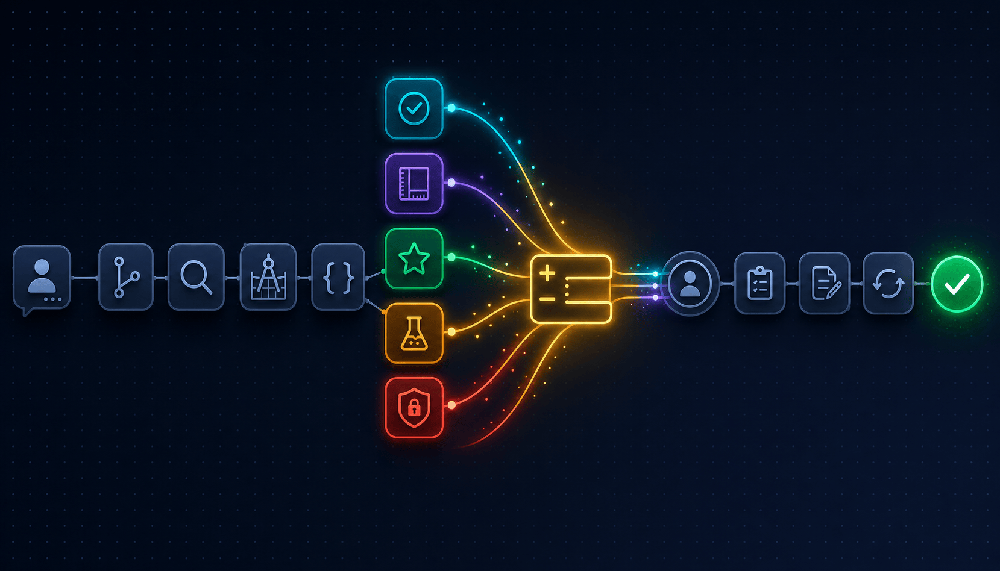

<div align="center">

# 🤖 AI Pipeline Cookbook

### A production-tested multi-agent development pipeline — anonymized from the real thing

**Local file-based state machine. 13 specialized Claude agents. One CLI command kicks the whole team off.**

*We've been running this for months on the way to building something larger. This cookbook is part of paving that road — open-sourced because the road itself is worth sharing.*

[](https://opensource.org/licenses/MIT)
[](https://anthropic.com)
[](CONTRIBUTING.md)

</div>

---

## What is this?

> **This is not a demo. We use this pipeline every working day to ship features.**

In one sentence: a **13-agent assembly line** that takes a plain-English task and turns it into a reviewed, tested, security-scanned, documented PR — end to end, no human in the loop except at two gates.

### Cookbook vs what we actually run

| Aspect | In production | In this cookbook |
|---|---|---|
| 13-agent assembly line | ✓ | ✓ |
| Parallel review fan-out (3 reviewers + tester + security) | ✓ | ✓ |
| Manifesto axes (perf / thread-safety / safety / observability) | ✓ | ✓ |
| Sprint Contract pattern | ✓ | ✓ |
| Idempotency + retry caps | ✓ | ✓ |
| Two human gates (design + QA) | ✓ | ✓ |
| **State machine** | Issue tracker — see [use-case doc](docs/use-case-tracker-driven-pipeline.md) | `.state/` filesystem |
| **Agent prompts** | Tuned to our stack and team rules | Generic, you adapt |
| **Coding conventions / pitfalls** | Baked into every prompt | Not included |
| **Learned lessons** | Months accumulated | Empty templates |

Treat this as the **working skeleton you specialize on top of**, not as a turn-key replica. Run the [quickstart](examples/quickstart/README.md) to confirm it works on your machine, then drop your real profiles in.

```bash
$ ./team.sh start "Add a health check endpoint that verifies dependencies"

Planner running...
✅ Plan created — 1 sub-task

  [1] 20260427-1432-hlt  module=<your-module>  risk=LOW  blocked_by=[]

Daemon spawned (pid 47213). Tail logs: ./team.sh logs --daemon

# ... ~15 minutes later ...

$ ./team.sh status
Daemon: RUNNING (pid 47213, uptime 0:14:22)
Active Tasks (0): (empty)
Recent Completed (last 5):
  20260427-1432-hlt  <your-module>  done  0:14:11  82k
```

That's it. One command. A reviewed, tested, security-scanned, documented PR-ready change on disk — produced by the same agent line-up we use to ship our own work, just with a local-filesystem backend instead of our tracker.

### What it looks like when the team is busy

The "wow" moment is the **review fan-out**: developer ships → 3 reviewer agents + tester + security-reviewer all spawn at once against the same diff. Five Claude subprocesses on one task, in parallel.

<p align="center">
  
</p>

A still capture of the same moment, in plain text, looks like this:

```
$ ./team.sh status

=== Team Status ===
Daemon: RUNNING (pid 47213, started 14:32:00Z, uptime 0:14:22)

Active Tasks (1):
ID                       MODULE      STATUS      OWNER                UPTIME
20260427-1432-hlt        manager     reviewing   review-correctness   0:01:23
20260427-1432-hlt        manager     reviewing   review-convention    0:01:23
20260427-1432-hlt        manager     reviewing   review-quality       0:01:23
20260427-1432-hlt        manager     reviewing   tester               0:01:23
20260427-1432-hlt        manager     reviewing   security_reviewer    0:01:23

Recent Completed (last 5):
  20260427-1240-cfg  shared       done   0:08:11  42k
  20260427-1130-rbc  manager      done   0:11:42  63k
==============================
```

Same task ID on five rows, five different OWNERs. That's the pipeline doing five concurrent reads of the same diff. We watch this in a tmux pane while the team works.

---

## Who this is for (and who it isn't)

> **This is not a beginner's tutorial. If you're new to LLM-based development pipelines, this isn't where to start — and we'd rather you knew that on line 1 than on day 3.**

**You'll feel at home here if:**
- You've already tried LangChain / CrewAI / AutoGen / LangGraph (or built your own loop) and concluded *"a single prompt does not ship features"*.
- You've shipped real software with real CI, real reviews, real on-call. You know what production-grade means and you want your AI pipeline to look like that — not like a Jupyter notebook.
- You read "13 agents in parallel against the same diff" and your first reaction was "yes, finally" — not "isn't that overkill?".
- You'd rather have a 440-line README that respects your time than a 30-second demo that hides the wires.

**Look elsewhere if:**
- You're searching for a "make me an AI agent" tutorial. This is a *system*, not an introduction.
- You want a single-prompt copy-paste solution. We tried that. It doesn't ship.
- You're doing a hackathon project. The setup ratio is wrong — adapt-then-ship beats install-and-go for production work, but a hackathon needs install-and-go.
- You expect a hosted UI, a button-click experience, or a SaaS dashboard. None of that is here.

We built this for ourselves. We open-sourced it on the off-chance someone else recognizes themselves in it. If you do — welcome. If you don't — there are friendlier introductions out there, and that's fine.

> **A note on what's actually here.** The agent and skill files in `.claude/agents/` and `.claude/skills/` are **surface-level versions** of what we actually run. We've kept the structure, the role names, the state-machine wiring, and enough of the prompts to make the pipeline functional — but the deeper details (full prompt heuristics, our internal coding conventions, our project-specific manifest_check items, accumulated lessons) are not in this repo. The pipeline runs and produces real output; it just won't produce *our* output. Treat this as a working skeleton you specialize on top of, not as a turn-key replica.

---

## Why this design?

Most "agent orchestration" demos break the moment you try them on real work. Three things make this one production-grade:

### 1. The filesystem is the state machine

Most AI pipelines invent custom state engines, message queues, or run everything in-process. We do none of that. The whole pipeline lives in a single directory:

```
.state/
├── active.json                       # the DAG: what's queued, in flight, blocked
├── completed.jsonl                   # append-only outcome log
├── locks/team.lock                   # daemon pid; prevents two daemons
└── tasks/<task-id>/
    ├── meta.json                     # status + role_done flags + retry counts
    ├── analysis.md                   # analyst output
    ├── design.md                     # architect output (Sprint Contract)
    ├── progress.md                   # developer output
    ├── reviews/{correctness,convention,quality,security}.json
    ├── tests.md                      # tester output
    ├── qa.md                         # qa output
    ├── docs.md                       # documenter output
    └── handoffs.jsonl                # inter-agent messages
```

`meta.json.status` is the dial. `meta.json.role_done.<role>` is **idempotency**: if the daemon restarts mid-pipeline, every agent that's already finished sees its flag and exits in 50ms. Nothing re-runs. Nothing duplicates.

You can `cat meta.json` and read what the team is doing. You can `tail -f handoffs.jsonl` and watch the conversation. You can `git diff .state/` and review what the AI just decided. **No black box.**

### 2. Upstream errors compound — so upstream uses bigger models

Every downstream agent inherits the upstream agent's mistakes. The analyst wrote a wrong edge case → the architect designs against a wrong spec → the developer ships a wrong feature → the reviewer rubber-stamps it.

So we put **Opus** on the upstream and security-critical roles, **Sonnet** on the structured downstream roles. Zero Haiku — we tested; cheap models compound errors faster than they save dollars.

| Role | Model | Why |
|---|---|---|
| `analyst`, `architect`, `developer`, `qa`, `security-reviewer` | Opus | Upstream errors are catastrophic; security findings need real reasoning |
| `review-correctness` | Opus | Catches the bugs that matter |
| `planner`, `reviewer`, `review-convention`, `review-quality`, `tester`, `documenter`, `retrospective` | Sonnet | Structured pattern matching; clear inputs and outputs |

### 3. Three reviewers in parallel

When the developer ships, **three reviewer agents spawn at once** against the same diff:

- **review-correctness** (Opus) — catches the actual bugs: BS coverage, thread-safety, perf
- **review-convention** (Sonnet) — style/lint deltas (whatever your linter says)
- **review-quality** (Sonnet) — DRY, SRP, complexity, dead code

Plus the **tester** runs the test suite and the **security-reviewer** does an OWASP pass. All five run as separate Claude subprocesses, in parallel, on the same diff.

This is the "wow" moment when you watch `team.sh status` during review:

```
Active Tasks (1):
ID                        MODULE       STATUS         OWNER             UPTIME
20260427-1432-hlt         manager      reviewing      reviewer          0:01:23
20260427-1432-hlt         manager      reviewing      tester            0:01:23
20260427-1432-hlt         manager      reviewing      security_reviewer 0:01:23
```

Same task, three rows, three Claude subprocesses chewing on the same diff at the same time.

---

## The pipeline

```
                        team.sh start "<task>"
                                │
                                ▼
                          ┌──────────┐
                          │ planner  │  Sonnet — splits task into sub-tasks,
                          └────┬─────┘  builds DAG, writes active.json
                               │
                               ▼
                          ┌──────────┐
                          │ analyst  │  Opus — requirements + edge cases +
                          └────┬─────┘  Behavioral Spec (BS-1, BS-2, ...)
                               │
                               ▼
                          ┌──────────┐
                          │architect │  Opus — Sprint Contract: API/schema/
                          └────┬─────┘  SPI/manifest. The single source of truth
                               │        downstream agents are graded against.
                               ▼
                          ┌──────────┐
                          │developer │  Opus — implements code. Up to 3
                          └────┬─────┘  retries if review/test/qa fails.
                               │
                  ┌────────────┼────────────┐
                  ▼            ▼            ▼
            ┌──────────┐ ┌──────────┐ ┌──────────┐
            │ reviewer │ │  tester  │ │ security │   ← parallel,
            │ (3 subs) │ │ (Sonnet) │ │  (Opus)  │     same diff
            └────┬─────┘ └────┬─────┘ └────┬─────┘
                 └────────────┼────────────┘
                              │  any FAIL → developer retries
                              ▼
                          ┌──────────┐
                          │    qa    │  Opus — E2E + smoke + UX. Final
                          └────┬─────┘  human-style sanity check.
                               │
                               ▼
                          ┌──────────┐
                          │documenter│  Sonnet — updates API contracts +
                          └────┬─────┘  STATUS.md
                               │
                               ▼
                          ┌──────────┐
                          │retrospec │  Sonnet — appends to
                          └────┬─────┘  learned-lessons/<module>-lessons.md
                               │
                               ▼
                              done
                  (moved to completed.jsonl)
```

Status state machine:

```
queued → analyzing → analyzed → designing → designed → developing → developed
       → reviewing (reviewer + tester + security in parallel)
       → reviewed | review_failed (→ developer retry, max 3)
       → qa-checking → qa_passed | qa_failed (→ developer retry, max 2)
       → documenting → documented → retrospecting → done
```

---

## Quick Start

### 5-minute confidence check (recommended)

Before adapting anything to your real codebase, **run the bundled
quickstart example** to confirm the pipeline works end-to-end on your
machine:

```bash
git clone https://github.com/apinizer/agentnizer-cookbook
cd agentnizer-cookbook

# Install Claude Code if you don't have it.
npm install -g @anthropic-ai/claude-code

# Drop in the demo profile (build/test/lint are all harmless `echo` calls).
cp examples/quickstart/profiles/demo.yaml .claude/profiles/demo.yaml

# Hand the team a tiny task.
./team.sh start "$(cat examples/quickstart/task.txt)"

# Watch the team work in another shell.
watch -n 2 ./team.sh status
```

When the daemon goes idle (`Daemon: STOPPED`), inspect what it produced:

```bash
ls .state/tasks/*/
cat .state/tasks/*/design.md          # the Sprint Contract
cat .state/tasks/*/reviews/*.json     # the verdicts
```

If those files exist, the pipeline works on your box. Full walkthrough +
troubleshooting in [`examples/quickstart/README.md`](examples/quickstart/README.md).

### Then adapt to your real project

```bash
cp .claude/.env.example .claude/.env
# Optional: edit if you want Slack notifications.

# Replace the example profiles with profiles for your real modules.
# Use .claude/profiles/manager.yaml / worker.yaml / shared.yaml as templates.
$EDITOR .claude/profiles/<your-module>.yaml

# Hand the team a real task in your repo.
./team.sh start "<your real task description>"
```

### Daemon controls

```bash
./team.sh status           # active tasks + recent completed
./team.sh logs --daemon    # tail the daemon log
./team.sh pause            # finish in-flight agents, no new spawns
./team.sh resume           # resume spawning
./team.sh stop             # SIGTERM the daemon (graceful 30s, then SIGKILL)
./team.sh resume-daemon    # restart after a crash — role_done flags pick up
```

---

## File Structure

```
.
├── team.sh                          # CLI: start / stop / status / pause / logs
├── README.md
├── CONTRIBUTING.md
├── .state/                          # runtime state (gitignored except README)
│   ├── README.md                    # schema documentation
│   ├── active.json
│   ├── completed.jsonl
│   ├── locks/
│   └── tasks/<task-id>/...
└── .claude/
    ├── .env.example
    ├── pipeline-workflow.md         # full reference + ASCII diagram
    │
    ├── agents/                      # 13 agent definitions
    │   ├── planner.md
    │   ├── analyst.md
    │   ├── architect.md
    │   ├── developer.md
    │   ├── reviewer.md              # orchestrator — spawns 3 sub-reviews
    │   ├── review-correctness.md
    │   ├── review-convention.md
    │   ├── review-quality.md
    │   ├── tester.md
    │   ├── qa.md
    │   ├── security-reviewer.md
    │   ├── documenter.md
    │   └── retrospective.md
    │
    ├── skills/                      # user-invocable slash commands
    │   ├── start/SKILL.md           # /start "<task>" → team.sh start
    │   ├── status/SKILL.md          # /status → team.sh status
    │   ├── ask/SKILL.md             # /ask "<q>" → read-only Q&A
    │   ├── verify/SKILL.md          # /verify → quick lint/build
    │   ├── feature/SKILL.md         # /feature "<desc>" → start with feature template
    │   ├── bugfix/SKILL.md          # /bugfix "<desc>" → hypothesis-first bug task
    │   ├── improve/SKILL.md         # /improve "<desc>" → improvement task
    │   ├── local-loop/SKILL.md      # /local-loop → interactive single-task mode
    │   └── process-issues/SKILL.md  # /process-issues file.csv → batch import
    │
    ├── hooks/
    │   ├── after-code-change.sh     # PostToolUse: module detect + warnings
    │   ├── check-status-update.sh   # Stop: nudge to update STATUS.md
    │   └── notify-slack.py          # optional — Slack notify (used minimally)
    │
    ├── scripts/
    │   └── pipeline-daemon.py       # the LSD (Local State Daemon)
    │
    ├── profiles/                    # per-module build/test/manifest config
    │   ├── shared.yaml               # cross-cutting library
    │   ├── manager.yaml              # control-plane example
    │   ├── worker.yaml               # data-plane example
    │   ├── frontend.yaml             # UI example
    │   ├── connectors.yaml           # integration-layer example
    │   └── providers.yaml            # external-service-adapter example
    │   # rename / replace these to match your project's modules
    │
    └── learned-lessons/             # retrospective writes here, tuner reads
        ├── shared-lessons.md
        ├── worker-lessons.md
        └── ...
```

---

## The Manifesto

Every change that flows through the pipeline is graded against **four axes**. The reviewer's job is to confirm all four were addressed; design and analysis tag the relevant axes upfront.

```
[performance]      Connection pooling. Async I/O. Streaming. Caching.
[thread-safety]    Stateless adapters. Advisory locks. Idempotent operations.
[safety]           Strict input validation. Secret scoping. Rate limits.
[observability]    Structured logs. OTel spans. Audit events.
```

These aren't aspirational. They're enforced. Reviewer reads `meta.json.manifesto_axes` (planner sets these), checks the change covers each tagged axis, and fails the review if any is missing.

---

## How "wow" actually works (the demo loop)

Run this on a fresh checkout. It's the demo.

```bash
# 1. Kick off a real feature in your repo
./team.sh start "<describe the feature you actually want>"

# 2. Watch the team work
watch -n 2 ./team.sh status
# You'll see: planner → analyst → architect → developer → (reviewer + tester + security-reviewer in parallel) → qa → documenter → retrospective

# 3. Read what they wrote
cat .state/tasks/*/analysis.md       # the spec
cat .state/tasks/*/design.md         # the Sprint Contract
cat .state/tasks/*/reviews/*.json    # the 3 review verdicts
cat .state/tasks/*/qa.md             # the E2E sanity check
git diff                             # the actual code

# 4. Hand it to a teammate. They review .state/ + the diff. Done.
```

The first time you watch three reviewer subprocesses line up against the same diff, you'll get it. We see this every day.

---

## Production adaptations

The cookbook ships a fully local example because it's the simplest thing that actually works. But the architecture has clean seams for production scaling. **None of this is required to run the cookbook**, but here's how to extend it:

### Make a tracker (Jira / Linear / GitHub Issues / ...) the state machine

Short version:

```
issue.status              ↔ meta.json.status
issue.labels              ↔ meta.json.role_done flags (e.g. "ai-developed")
issue.comments            ↔ analysis.md / design.md / progress.md (one comment per agent)
custom field "module"     ↔ meta.json.module
```

**The daemon's poll loop becomes a tracker poll.** Instead of reading `active.json`, query the tracker for *"open issues with label `ai-pipeline` whose status is one I handle"*. Instead of writing files, post comments and transition statuses. Agent prompts don't change — they still read structured input, write structured output.

For the long version — a full diagrammed reference of what a tracker-driven shape *can* look like (status flow, decomposition, retry loops, run modes, the parts we're deliberately *not* showing) — see:

> 📄 **[`docs/use-case-tracker-driven-pipeline.md`](docs/use-case-tracker-driven-pipeline.md)**

That document is a sketched composite, not a working module. Read its disclaimer first.

### Use Slack for action-required gates

The local example sends Slack messages only on critical events (security alert, retry-limit, task failure) — `notify-slack.py` is a fire-and-forget hook called from the daemon. In production, you can dial it up:

- **Design Gate**: after the architect writes `design.md`, post it to Slack with a *"reply 👍 to approve, ❌ + reason to reject"* prompt. Pause the pipeline; resume when the human replies. The daemon polls `meta.json.gates.design = "approved" | "rejected"`.
- **QA Gate**: after the developer ships, ping the on-call human with the diff. Same approve/reject pattern.
- **Security alerts**: keep these unconditional, even in dev — a CRITICAL OWASP finding shouldn't wait for someone to look at a dashboard.

The cookbook's `notify-slack.py` already supports message types for these — wire them into your gate decisions.

### Scale beyond one machine

`pipeline-daemon.py` runs one daemon per repo. To scale:
- Move `.state/` to NFS or S3-FUSE so multiple daemons share state.
- Use a database (Postgres + `SELECT FOR UPDATE SKIP LOCKED`) instead of `active.json` for the queue.
- Lift the daemon's `acquire_lock()` to a distributed lock (Postgres advisory lock, Redis SETNX, ZooKeeper).

The agent prompts still don't change.

---

## A note on benchmarks (we don't have them yet, on purpose)

You'll notice this README claims "production-grade" without a single number. That's deliberate.

We've recently started running this at scale; we don't have a long-enough baseline to publish honest averages, and the metrics that matter (retry rate, token cost, time-to-PR) are **wildly task-dependent**. A 2-file refactor and a 6-file feature aren't the same number; a `[CRITICAL]`-risk module and a `[LOW]` module aren't the same number; a clean spec at triage and a fuzzy one aren't the same number. Averaging across them produces a figure that looks authoritative and isn't.

We'd rather wait until we have something we'd defend in a code review than ship a chart that markets well.

When we publish numbers, they'll come with the task distribution behind them, the manifesto-axis breakdown, and the retry-rate histogram — not just one bold "X% faster" headline. Until then, run the [quickstart](examples/quickstart/README.md) on your own codebase and judge with your own measurements.

---

## Real-world lessons (from running this in production)

**The single biggest lesson: triage is spec-first, and nothing ambiguous leaves it.** Everything downstream — analyst, architect, every reviewer — compounds whatever fuzziness survives the triage step. If the task description says "make login better", the analyst will write some plausible-sounding edge cases, the architect will design around them, the developer will ship them, and three reviewers will rubber-stamp it — and you'll get a "fix" you didn't want. We treat triage as the moment where a task either becomes a *spec* (concrete inputs, concrete outputs, concrete acceptance criteria, named modules, complexity classified) or it doesn't enter the pipeline at all. Tasks with `[?]` markers in the planner's output go to **Awaiting Info**, not to the analyst. The 90 seconds spent demanding clarity here saves a full developer-retry later.

**The Design Gate (when you turn it on) is the second-highest-leverage moment.** It catches the residual ambiguity that triage missed. Catching scope creep at design takes 90 seconds; catching it at QA takes a full developer-retry. Spend your human attention here.

**Retry rates are the canary.** When a module's `developer→reviewer` retry rate climbs, the architect's designs are slipping, not the developer. Retrospective dumps lessons into `learned-lessons/<module>-lessons.md`; you read this weekly and inject the patterns back into the architect prompt.

**Local-first beats Slack-first for solo work.** The team gets noisy fast in Slack — five subprocesses, three reviewers, retries. Watching `./team.sh status` in a tmux pane is calmer and gives you the exact same information.

**The DAG is real.** When you split a task with `planner` into 5 parallel sub-tasks, the daemon really does run them in parallel up to `LSD_MAX_PARALLEL_TASKS` (default 3). That's a real 3× speedup for parallelizable feature work.

**Idempotency is non-negotiable.** Every agent's first step is *"is `role_done.<me>` set? If yes, exit."* This is what makes crash-resume work. Without it, the daemon re-spawning mid-task corrupts state. Don't skip it when you write new agents.

---

## Adapting to your stack

The pipeline is **language and framework agnostic** — every stack-specific detail lives in `.claude/profiles/*.yaml`. To adapt:

- **Pick your stack.** Edit `profiles/*.yaml` — fill in `build`, `test`, `lint` commands for whatever your codebase uses. Update `manifest_check` with your language's idioms.
- **Pick your layout.** Update `read_allowlist` defaults in `planner.md` and the module-detection paths in `hooks/after-code-change.sh`.
- **Monorepo?** Works fine — point each profile's `build`/`test`/`lint` at the right sub-path.
- **No Slack?** Don't set the Slack env vars. `notify-slack.py` no-ops gracefully.

The agents themselves don't care what tech you use; they read the profile and run whatever command is there.

---

## Contributing

Found a better pattern? Built a tracker adapter? Added an agent role? See [CONTRIBUTING.md](CONTRIBUTING.md).

The most useful contributions:
- **Tracker adapters** — make `pipeline-daemon.py` poll Jira / Linear / GitHub Issues instead of `.state/active.json`.
- **New agent roles** — performance-profiler, accessibility-reviewer, i18n-checker, etc.
- **Module profiles** — Go, Java, Rust, Ruby starter profiles.
- **Lessons** — `learned-lessons/*.md` patterns from your runs.

---

## Where this is going

The cookbook is what we run today. We're also using it as a way to **understand what the road needs**: visual orchestration, conversational composition, proper monitoring, marketplace-shaped reuse, enterprise-grade audit and tenancy. We have opinions on each of those — opinions that came from many months of actually shipping with this pipeline, not from whiteboarding.

We're not ready to talk about what we're building next. We will be, in time. For now: this is the anonymized version of how the team that's paving that road works day-to-day. If something here resonates, you're probably the kind of person we'll want to hear from when we're ready.

[Star or watch the repo](https://github.com/apinizer/agentnizer-cookbook) if you want to know when that conversation starts.

---

## License

MIT. Use it, adapt it, ship things.

---

<div align="center">

**Built with frustration, refined with care, running in production.**

*The team you're getting is the team that built itself — and is, quietly, building what comes next.*

</div>
