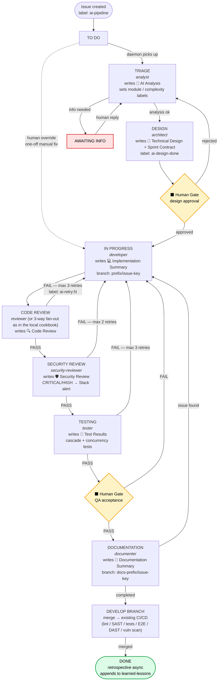
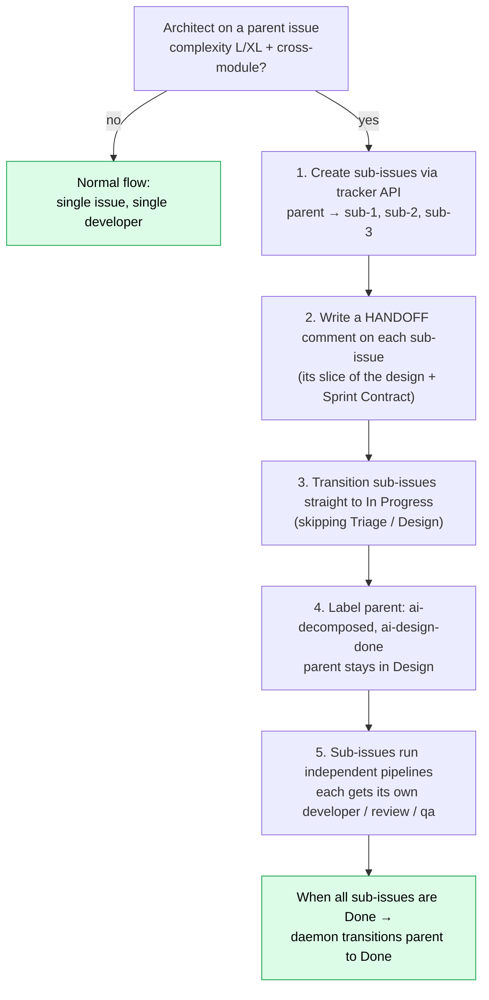

# Use Case: A Tracker-Driven AI Pipeline

> **A reference shape, not a working module.** The local-state cookbook (`./team.sh start`) ships and runs. This doc sketches the production deployment most teams converge on once humans, audit, and Slack enter the picture.
>
> The flow is anonymized — module names, statuses, transition IDs, retry counts are illustrative, not literal. Auth, rate-limiting, multi-tenancy, audit plumbing, and exact tracker API calls are deliberately out of scope. Real teams ship something that looks ~70% like this diagram, ~30% project-specific.
>
> Spec for what *does* run today: [`pipeline-workflow.md`](../pipeline-workflow.md).

---

## Why a tracker-driven shape?

The local-state cookbook (`.state/` + `team.sh`) is the right starting
point and is enough for many teams. But once a pipeline runs across many
people and many parallel tasks, three problems usually push teams toward
a tracker:

1. **Visibility for non-engineers.** Product managers, QA, support — they
   already live in the tracker. Putting AI agent activity *into* the
   tracker (as comments, label changes, status transitions) means they
   don't need a new tool.
2. **Durable audit trail in a familiar place.** A tracker comment is a
   first-class record with timestamps, authors, and immutable history.
   Files in `.state/` work but don't naturally surface to compliance /
   audit reviewers.
3. **Native human gates.** Approving a design or accepting QA is a status
   transition the team is already comfortable with — no new gating UI
   needed.

The tradeoff: more moving parts, tracker rate limits, custom-field
discipline.

### File-state scales your costs. Tracker-state scales your team.

Adopt tracker-state for collaboration; **don't assume it strictly dominates** the file-state version. After running both shapes side by side, the file-state machine turned out to be a better fit for the AI pipeline's hot path on several axes:

- **Token cost on every read.** Each agent that needs prior context (analyst output, design, last review verdict) hits the tracker via API; that's a network round-trip plus the comment body re-fetched into the agent's context window every time. With file-state, the same context is a local `read()` and the prompt cache hits cleanly because the path is byte-stable. On long retry chains the savings compound — a developer cycle 2 retry on tracker-mode pulls back roughly 30-50% more context tokens than the same retry on file-state. Multiply by daily run volume and the bill is real.
- **Pipeline tick latency.** File-state changes are visible to the daemon in milliseconds (filesystem watch or fast polling). Tracker polls at 30–60s and you don't get to make them faster — vendors will throttle you. AI pipelines feel snappy at sub-second tick; sluggish at 30s.
- **API rate limits clip parallelism.** A 5-way review fan-out + 3-way exploration sub-spawn is 8 simultaneous comment writes per task. Run 4 tasks in parallel and you're at 32 writes per cycle — most trackers' rate limits start fighting back. The filesystem has no quota.
- **Idempotency is cheaper.** Atomic JSON writes are one syscall. Atomic tracker updates require multi-field PATCHes with optimistic-concurrency tokens; one half-applied update + one daemon crash = stale state.
- **Debugging and replay.** `cat .state/tasks/<id>/handoffs.jsonl | jq` beats clicking through tracker history. Replaying a task offline (re-spawn the agent from a saved meta.json) takes seconds; reproducing a tracker-driven run requires VCR fixtures of the API.
- **Offline / air-gapped.** No tracker = file-state pipeline still runs. Tracker-state is dead.

The honest framing: **tracker-state wins on collaboration and audit; file-state wins on AI economics and operational speed.** Many production teams end up with a hybrid — file-state as the daemon's actual source of truth, with the tracker as a *projection* that the daemon writes to (one comment per phase, status transition on gate change). The agents read from the local files; humans read from the tracker. Both audiences served, neither tax paid by the wrong party.

---

## The mental model

```
LOCAL VERSION (what cookbook ships)        TRACKER-DRIVEN VERSION (this doc)
─────────────────────────────────────      ────────────────────────────────
.state/active.json                ↔        Tracker query: "issues with label
                                            ai-pipeline whose status is one
                                            we handle"

.state/tasks/<id>/meta.json       ↔        Tracker issue (status field +
                                            custom fields + labels)

.state/tasks/<id>/analysis.md     ↔        Tracker comment:
                                              "🤖 AI Analysis: ..."

.state/tasks/<id>/design.md       ↔        Tracker comment:
                                              "📐 Technical Design: ..."

.state/tasks/<id>/progress.md     ↔        Tracker comment:
                                              "💻 Implementation: ..."

reviews/*.json + tests.md + qa.md ↔        Tracker comments (one per agent)

role_done.<role> = "<ts>"         ↔        Tracker label:
                                              ai-analyzed, ai-designed,
                                              ai-developed, ai-reviewed, ...
                                            (idempotency check: agent reads
                                             label before running)

handoffs.jsonl                    ↔        The tracker comment stream itself
                                            (it's append-only by design)
```

The agent prompts hardly change. They still read structured input and
write structured output — the **I/O backend** swaps. The daemon's poll
loop becomes a tracker poll instead of a filesystem scan.

---

## Example flow

The following is a *representative* end-to-end. Status names are generic;
your tracker's terminology will differ.



---

## Roles in this variant

```
┌───────────────────┬───────────────────────────────┬─────────────────────────────┐
│ Agent             │ Status it owns                │ Output (one tracker comment)│
├───────────────────┼───────────────────────────────┼─────────────────────────────┤
│ analyst       │ Triage                        │ 🤖 AI Analysis              │
│ architect         │ Design                        │ 📐 Technical Design         │
│ developer         │ In Progress                   │ 💻 Implementation Summary   │
│ reviewer          │ Code Review                   │ 🔍 Code Review              │
│ security-reviewer │ Security Review               │ 🛡️ Security Review          │
│ tester            │ Testing                       │ 🧪 Test Results             │
│ documenter        │ Documentation                 │ 📝 Documentation Summary    │
│ retrospective     │ Done (async, after CI merge)  │ — writes to learned-lessons │
│ tuner             │ Periodic (e.g. weekly)        │ — proposes prompt updates   │
└───────────────────┴───────────────────────────────┴─────────────────────────────┘
```

The local cookbook has 13 synchronous agents (planner + analyst + architect + developer + 4 reviewers + tester + qa + security-reviewer + documenter + retrospective) plus an optional weekly tuner. This sketch shows a 9-role variant for clarity. You can mix: **the parallel-reviewer fan-out from the local pipeline drops straight into the tracker variant** — three sub-review comments instead of one, then an aggregator comment.

---

## Human gates — three configurable

Tracker-driven deployments commonly enable three gates (versus the local cookbook, which ships only the Code Review gate as mandatory). All three map cleanly onto tracker statuses:

```
┌─────────────────────────┬───────────────────┬──────────────────────────────────────┐
│ Gate                    │ Tracker status    │ What the human does                  │
├─────────────────────────┼───────────────────┼──────────────────────────────────────┤
│ 1. Awaiting Info        │ Awaiting Info     │ Answers an open decision the analyst │
│    (analyst / architect │                   │ or architect surfaced. One comment   │
│    raises)              │                   │ → transition back to Triage/Design.  │
│                         │                   │ Saves a developer-cycle that would   │
│                         │                   │ have implemented the wrong thing.    │
│                         │                   │                                      │
│ 2. Human Code Review    │ Code Review (or   │ Reads diff + Sprint Contract +       │
│    (mandatory for code) │  Ready for QA)    │ aggregated review comments. If good, │
│                         │                   │ transitions forward. If not, comments│
│                         │                   │ + transitions to In Progress.        │
│                         │                   │                                      │
│ 3. Human Final Test     │ Ready for QA      │ Actually runs the feature in the     │
│    (manual verification │  (or Human Test)  │ test/staging environment. Validates  │
│    in staging)          │                   │ acceptance criteria, real I/O, third-│
│                         │                   │ party API behaviour, UX feel.        │
│                         │                   │ Pass → Documentation. Fail → back to │
│                         │                   │ In Progress with the bug description.│
└─────────────────────────┴───────────────────┴──────────────────────────────────────┘
```

Everything else is automated. **None of the three gates auto-approve** — the daemon halts and waits for the tracker status to flip. That's the whole point: agents handle volume, humans handle judgement.

---

## Real-time visibility via Slack — the team's live ops view

Once the pipeline is tracker-driven, **Slack becomes the team's pipeline dashboard for free**. No separate UI, no Grafana board, no internal tool — a Slack channel subscribed to the daemon's notification hook gives every engineer a synchronous view of what's happening across the entire fleet of in-flight tasks.

**Slack becomes your ops dashboard with zero extra code.** A production deployment wires `notify-slack.py` to fire on the events below. (Full 11-event matrix lives in [`pipeline-workflow.md`](../pipeline-workflow.md); the table here covers the seven most useful for the team chat.)

| Event | Slack message shape | Why the team cares |
|---|---|---|
| `phase_transition` | `[PROJ-1247] Triage → Design (architect)` | The "live tail" — at-a-glance, who's working on what right now. Engineers see when their assigned issue picks up. |
| `awaiting_info` | `[PROJ-1248] Awaiting Info: "Should the API return 404 or 422 when the upstream is down?" (cc @analyst-on-duty)` | Specific human attention. The Slack ping IS the gate — humans answer in the channel or in the tracker comment. |
| `human_review_pending` | `[PROJ-1247] ready for code review — diff: <link> · contract: SC-1..SC-4 PASS` | Reviewer-on-duty claims with an emoji. No need to poll the tracker; the channel tells you when reviews are queued. |
| `human_final_test_pending` | `[PROJ-1247] staging: <url> — please verify SC-3 (login retry)` | QA-on-duty knows when there's something to verify. |
| `security_alert` | `🚨 [PROJ-1247] CRITICAL — A03 Injection: input not parameterised at <file>:<line>` | Always sent. Never gets muted. Even at 3am the security on-call sees it. |
| `retry_limit` | `⚠ [PROJ-1247] developer exhausted 3 retries on review_failed → architect revision` | Distinguishes "code is broken" from "design is wrong." Operator escalates accordingly. |
| `done` | `[PROJ-1247] DONE — 47 min wall, 312k tokens, $1.24` | Audit trail in the channel. Useful for cost/timing pattern analysis. |

A typical channel looks like this in steady state:

```
14:02   [PROJ-1247] Triage → Design (architect)
14:03   [PROJ-1248] Code Review → Awaiting Info: "Confirm: do we keep the v1 column?"
14:04   [PROJ-1244] In Progress: developer started — branch PROJ-1244
14:08   [PROJ-1247] Design → Awaiting Info (design approval)  cc @design-on-duty
14:11   [PROJ-1248] Awaiting Info → Code Review (resolved by @engineer-a)
14:14   🚨 [PROJ-1244] HIGH — A07 Auth: JWT secret read from env without validation
14:15   [PROJ-1244] In Progress: developer retry 1/3 (security_failed)
14:22   [PROJ-1247] Design → In Progress (approved by @engineer-b)
14:39   [PROJ-1248] DONE — 38 min wall, 245k tokens, $0.94
```

Anyone glancing at the channel knows what's running, what's blocked, and where to help. Pair this with the tracker as system-of-record (issue status = pipeline status) and the team gets:
- Audit trail (tracker is a proper system of record)
- Live visibility (Slack is synchronous)
- Native gates (status transitions are first-class human actions)
- Multi-engineer collaboration (reviewer/QA-on-duty rotates by claiming Slack messages)

…all without anyone writing dashboard code.

---

## Issue decomposition (when one task is too big)

For L/XL tasks the architect can split the parent into sub-issues. The
sub-issues skip Triage and Design (the parent already designed them) and
go straight into In Progress.



Decomposition rules of thumb (illustrative; tune to your team):
- L/XL complexity + multiple modules → split
- L/XL complexity + 10+ files → split
- M complexity + 3+ independent workflows → split
- S/M complexity + single module → don't split
- Sequential dependency chain in one module → don't split (just sequence the work)

Caps that have worked for teams adopting this:
- Sub-issues per parent: 2–5
- Decompose chain depth: max 3 (no sub-sub-sub-issues)

---

## Parallel processing

```
The daemon polls the tracker. One poll might return:

  Triage           → [PROJ-1250]   spawn analyst
  Design           → [PROJ-1249]   spawn architect (if not ai-design-done)
  In Progress      → [PROJ-1248]   spawn developer
  Code Review      → [PROJ-1247]   spawn reviewer
  Ready for QA     → [PROJ-1245]   wait — human only

  4 issues in flight simultaneously (within a max-parallel cap).
  Same module → serialized (module guard prevents conflicting branches).
  Different modules → genuinely parallel.
```

---

## Run modes (pipeline mode vs local mode)

A team running this in production usually wants **both** modes available:

```
┌───────────────────────────────────────────────────────────────────────┐
│                                                                       │
│  PIPELINE MODE                       LOCAL MODE                       │
│  ─────────────                       ──────────                       │
│  Daemon-triggered                    User-invoked, on demand          │
│  Tracker issue + comments            Prompt / description             │
│  Status transitions automatic        No tracker, no transitions       │
│  Output: tracker comments            Output: terminal                 │
│                                                                       │
│  Start:                              Start:                           │
│    /start                              ./team.sh start "<task>"       │
│    /bugfix PROJ-1247                   /bugfix "<description>"        │
│                                                                       │
│  Use when: real product work,        Use when: spike, prototype,      │
│  audit trail needed, multi-person    air-gapped work, learning the    │
│  collaboration                       pipeline                         │
│                                                                       │
└───────────────────────────────────────────────────────────────────────┘
```

The local mode is exactly what the cookbook ships today. Pipeline mode is
the adaptation this document sketches.

---

## What we're NOT showing here

This document deliberately leaves out:

- **The exact tracker REST/MCP calls** — every tracker has its own API
  shape; mapping the abstract operations (`get_issues_with_status`,
  `add_comment`, `transition_issue`) to your tracker is a discrete piece
  of work.
- **Auth and credentials wiring** — bot accounts, API tokens, scoped
  permissions, rotation policies.
- **Multi-tenancy in the daemon** — running one daemon per project vs one
  daemon serving many projects.
- **Branch and merge automation** — branch naming, MR/PR creation, CI
  hand-off, post-merge cleanup.
- **Audit trail and compliance plumbing** — KVKK / SOC 2 / HIPAA-grade
  audit log requirements differ by industry.
- **Backpressure and rate-limiting** — every tracker has request quotas;
  production deployments need an in-process rate limiter and exponential
  backoff.
- **Custom-field schemas** — what custom fields you add (module,
  complexity, retry-counter, ai-version) and how the daemon and agents
  read them is project-specific.
- **Sprint and release management** — how AI-pipeline issues coexist with
  human-driven sprint planning.

These are real and important; we just don't try to fit them all in one
document. If you adopt this pattern, expect a multi-week integration
project to fill them in.

---

## Where to start (if you actually want to do this)

1. **Run the local cookbook end-to-end** on your codebase first. The
   local pipeline is enough to validate that the agent prompts work for
   your stack.
2. **Pick one issue type to migrate** (we usually recommend "bug" — the
   feedback loop is fastest).
3. **Implement one tracker adapter operation at a time:**
   - `query_pipeline_issues()` — read open issues with the pipeline label
   - `add_comment(issue, body)` — post agent output
   - `transition(issue, target_status)` — move the issue
   - `add_label(issue, label)` — set idempotency labels
4. **Replace `.state/active.json` reads in the daemon** with
   `query_pipeline_issues()`. Keep `.state/tasks/<id>/` for *temporary*
   files during agent runs (logs, scratch); the durable record lives in
   the tracker.
5. **Test in a sandbox project**, with a single human actually doing the
   gates, for a couple of weeks. Tune retry caps, idempotency labels,
   gate prompts.
6. **Roll out to one team.**

Don't try to do all of this at once.

---

## See also

- [`README.md`](../README.md) — the cookbook's local pipeline (what
  actually runs today)
- [`pipeline-workflow.md`](../pipeline-workflow.md) —
  full reference for the local pipeline
- [`CONTRIBUTING.md`](../CONTRIBUTING.md) — if you'd like to contribute a
  tracker adapter back to the cookbook
