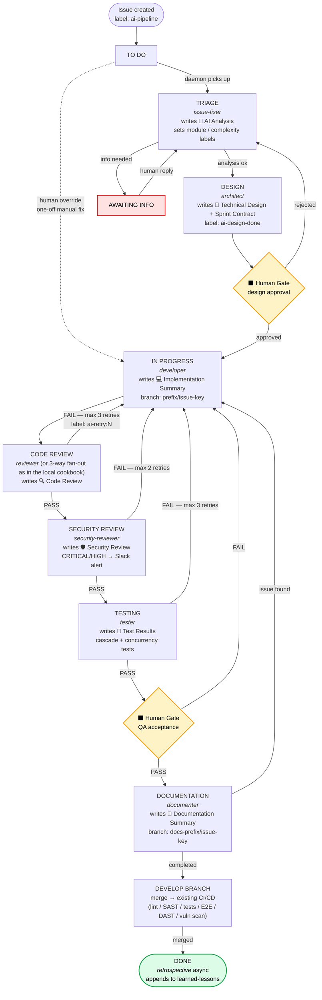
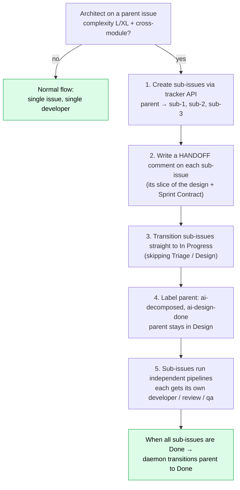

# Use Case: A Tracker-Driven AI Pipeline

> **Read this first.**
>
> This document is **illustrative**. It sketches *one possible production
> shape* of the cookbook's pipeline, in which an issue tracker (Jira /
> Linear / GitLab Issues / GitHub Issues / your-tracker-of-choice) takes
> the role that `.state/` plays in the local example.
>
> A few things to keep in mind:
>
> 1. **The cookbook does not ship this.** What you can run today is the
>    local-state pipeline (`./team.sh start`). The tracker-driven shape
>    described here is an **adaptation pattern**, not a working module.
> 2. **This is not a description of any specific company's actual pipeline.**
>    The flow below is a generalized, anonymized composite — module names,
>    status names, transition IDs, label names, and retry counts are all
>    *examples*, not literal copies of any production deployment.
> 3. **Many details are deliberately omitted.** Auth, rate-limiting,
>    permission models, multi-tenancy, audit-trail wiring, observability
>    plumbing, and the exact tracker API call sequences are all left out.
>    What's here is the *flow*; production-grade details are an exercise
>    for the team adopting the pattern.
> 4. **Don't read this as "so this is what you do?"** It's a *reference
>    shape* you can borrow from. Real teams adopting this end up with
>    something that looks like 60–80% of this diagram and 20–40%
>    project-specific variations.
>
> If you want the real, working, every-detail-included implementation,
> read [`.claude/pipeline-workflow.md`](../.claude/pipeline-workflow.md) —
> that one runs.

---

## Why a tracker-driven shape?

The local-state cookbook (`.state/` + `team.sh`) is the right starting
point and is enough for many teams. But once a pipeline runs across many
people and many parallel tasks, three problems usually push teams toward
a tracker:

1. **Visibility for non-engineers.** Product managers, QA, support — they
   already live in the tracker. Putting AI agent activity *into* the
   tracker (as comments, label changes, status transitions) means they
   don't need a new tool.
2. **Durable audit trail in a familiar place.** A tracker comment is a
   first-class record with timestamps, authors, and immutable history.
   Files in `.state/` work but don't naturally surface to compliance /
   audit reviewers.
3. **Native human gates.** Approving a design or accepting QA is a status
   transition the team is already comfortable with — no new gating UI
   needed.

The tradeoff: more moving parts, tracker rate limits, custom-field
discipline.

---

## The mental model

```
LOCAL VERSION (what cookbook ships)        TRACKER-DRIVEN VERSION (this doc)
─────────────────────────────────────      ────────────────────────────────
.state/active.json                ↔        Tracker query: "issues with label
                                            ai-pipeline whose status is one
                                            we handle"

.state/tasks/<id>/meta.json       ↔        Tracker issue (status field +
                                            custom fields + labels)

.state/tasks/<id>/analysis.md     ↔        Tracker comment:
                                              "🤖 AI Analysis: ..."

.state/tasks/<id>/design.md       ↔        Tracker comment:
                                              "📐 Technical Design: ..."

.state/tasks/<id>/progress.md     ↔        Tracker comment:
                                              "💻 Implementation: ..."

reviews/*.json + tests.md + qa.md ↔        Tracker comments (one per agent)

role_done.<role> = "<ts>"         ↔        Tracker label:
                                              ai-analyzed, ai-designed,
                                              ai-developed, ai-reviewed, ...
                                            (idempotency check: agent reads
                                             label before running)

handoffs.jsonl                    ↔        The tracker comment stream itself
                                            (it's append-only by design)
```

The agent prompts hardly change. They still read structured input and
write structured output — the **I/O backend** swaps. The daemon's poll
loop becomes a tracker poll instead of a filesystem scan.

---

## Example flow

The following is a *representative* end-to-end. Status names are generic;
your tracker's terminology will differ.



---

## Roles in this variant

```
┌───────────────────┬───────────────────────────────┬─────────────────────────────┐
│ Agent             │ Status it owns                │ Output (one tracker comment)│
├───────────────────┼───────────────────────────────┼─────────────────────────────┤
│ issue-fixer       │ Triage                        │ 🤖 AI Analysis              │
│ architect         │ Design                        │ 📐 Technical Design         │
│ developer         │ In Progress                   │ 💻 Implementation Summary   │
│ reviewer          │ Code Review                   │ 🔍 Code Review              │
│ security-reviewer │ Security Review               │ 🛡️ Security Review          │
│ tester            │ Testing                       │ 🧪 Test Results             │
│ documenter        │ Documentation                 │ 📝 Documentation Summary    │
│ retrospective     │ Done (async, after CI merge)  │ — writes to learned-lessons │
│ tuner             │ Periodic (e.g. weekly)        │ — proposes prompt updates   │
└───────────────────┴───────────────────────────────┴─────────────────────────────┘
```

The local cookbook has 13 agents (incl. 3 parallel sub-reviewers, separate
QA, separate planner). This sketch shows a 9-role variant for clarity. You
can mix: **the parallel-reviewer fan-out from the local pipeline drops
straight into the tracker variant** — three sub-review comments instead of
one, then an aggregator comment.

---

## Human gates (only two of them)

```
┌──────────────────┬─────────────────┬───────────────────────────────────┐
│ Gate             │ Tracker status  │ What the human does               │
├──────────────────┼─────────────────┼───────────────────────────────────┤
│ Design Approval  │ Design          │ Reads the 📐 Technical Design     │
│                  │                 │ comment. If good, transitions to  │
│                  │                 │ "In Progress". If not, comments + │
│                  │                 │ transitions back to Triage.       │
│                  │                 │                                   │
│ QA Acceptance    │ Ready for QA    │ Actually runs the feature in the  │
│                  │                 │ test environment. Validates AC.   │
│                  │                 │ Pass → Documentation. Fail →      │
│                  │                 │ back to In Progress with reason.  │
└──────────────────┴─────────────────┴───────────────────────────────────┘
```

Everything else is automated.

---

## Issue decomposition (when one task is too big)

For L/XL tasks the architect can split the parent into sub-issues. The
sub-issues skip Triage and Design (the parent already designed them) and
go straight into In Progress.



Decomposition rules of thumb (illustrative; tune to your team):
- L/XL complexity + multiple modules → split
- L/XL complexity + 10+ files → split
- M complexity + 3+ independent workflows → split
- S/M complexity + single module → don't split
- Sequential dependency chain in one module → don't split (just sequence the work)

Caps that have worked for teams adopting this:
- Sub-issues per parent: 2–5
- Decompose chain depth: max 3 (no sub-sub-sub-issues)

---

## Parallel processing

```
The daemon polls the tracker. One poll might return:

  Triage           → [PROJ-1250]   spawn issue-fixer
  Design           → [PROJ-1249]   spawn architect (if not ai-design-done)
  In Progress      → [PROJ-1248]   spawn developer
  Code Review      → [PROJ-1247]   spawn reviewer
  Ready for QA     → [PROJ-1245]   wait — human only

  4 issues in flight simultaneously (within a max-parallel cap).
  Same module → serialized (module guard prevents conflicting branches).
  Different modules → genuinely parallel.
```

---

## Run modes (pipeline mode vs local mode)

A team running this in production usually wants **both** modes available:

```
┌───────────────────────────────────────────────────────────────────────┐
│                                                                       │
│  PIPELINE MODE                       LOCAL MODE                       │
│  ─────────────                       ──────────                       │
│  Daemon-triggered                    User-invoked, on demand          │
│  Tracker issue + comments            Prompt / description             │
│  Status transitions automatic        No tracker, no transitions       │
│  Output: tracker comments            Output: terminal                 │
│                                                                       │
│  Start:                              Start:                           │
│    /sprint-loop                        ./team.sh start "<task>"       │
│    /bugfix PROJ-1247                   /bugfix "<description>"        │
│                                                                       │
│  Use when: real product work,        Use when: spike, prototype,      │
│  audit trail needed, multi-person    air-gapped work, learning the    │
│  collaboration                       pipeline                         │
│                                                                       │
└───────────────────────────────────────────────────────────────────────┘
```

The local mode is exactly what the cookbook ships today. Pipeline mode is
the adaptation this document sketches.

---

## What we're NOT showing here

This document deliberately leaves out:

- **The exact tracker REST/MCP calls** — every tracker has its own API
  shape; mapping the abstract operations (`get_issues_with_status`,
  `add_comment`, `transition_issue`) to your tracker is a discrete piece
  of work.
- **Auth and credentials wiring** — bot accounts, API tokens, scoped
  permissions, rotation policies.
- **Multi-tenancy in the daemon** — running one daemon per project vs one
  daemon serving many projects.
- **Branch and merge automation** — branch naming, MR/PR creation, CI
  hand-off, post-merge cleanup.
- **Audit trail and compliance plumbing** — KVKK / SOC 2 / HIPAA-grade
  audit log requirements differ by industry.
- **Backpressure and rate-limiting** — every tracker has request quotas;
  production deployments need an in-process rate limiter and exponential
  backoff.
- **Custom-field schemas** — what custom fields you add (module,
  complexity, retry-counter, ai-version) and how the daemon and agents
  read them is project-specific.
- **Sprint and release management** — how AI-pipeline issues coexist with
  human-driven sprint planning.

These are real and important; we just don't try to fit them all in one
document. If you adopt this pattern, expect a multi-week integration
project to fill them in.

---

## Where to start (if you actually want to do this)

1. **Run the local cookbook end-to-end** on your codebase first. The
   local pipeline is enough to validate that the agent prompts work for
   your stack.
2. **Pick one issue type to migrate** (we usually recommend "bug" — the
   feedback loop is fastest).
3. **Implement one tracker adapter operation at a time:**
   - `query_pipeline_issues()` — read open issues with the pipeline label
   - `add_comment(issue, body)` — post agent output
   - `transition(issue, target_status)` — move the issue
   - `add_label(issue, label)` — set idempotency labels
4. **Replace `.state/active.json` reads in the daemon** with
   `query_pipeline_issues()`. Keep `.state/tasks/<id>/` for *temporary*
   files during agent runs (logs, scratch); the durable record lives in
   the tracker.
5. **Test in a sandbox project**, with a single human actually doing the
   gates, for a couple of weeks. Tune retry caps, idempotency labels,
   gate prompts.
6. **Roll out to one team.**

Don't try to do all of this at once.

---

## See also

- [`README.md`](../README.md) — the cookbook's local pipeline (what
  actually runs today)
- [`.claude/pipeline-workflow.md`](../.claude/pipeline-workflow.md) —
  full reference for the local pipeline
- [`CONTRIBUTING.md`](../CONTRIBUTING.md) — if you'd like to contribute a
  tracker adapter back to the cookbook
