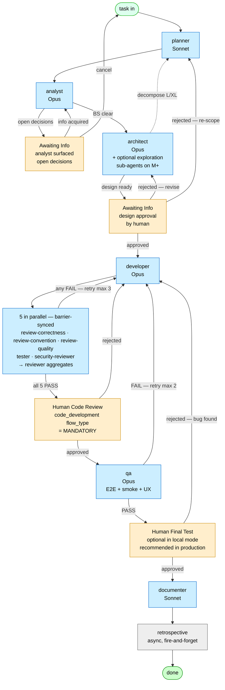

# AI Pipeline Workflow — Reference

This is the full reference for the local-state pipeline. The daemon
(`.claude/scripts/pipeline-daemon.py`) drives everything. State lives in
`.state/`. Agents are subprocesses spawned by the daemon.

For a quick "how do I use this?", see the top-level `README.md`. This
document is the deep dive.

## The 13 Roles (+ 1 optional)

The synchronous assembly line is **13 agents** spawned by the daemon for every task. A 14th — the `tuner` — runs **weekly on cron**, not in the per-task flow.

| # | Role | Model | Purpose | Output file |
|---|------|-------|---------|-------------|
| 1 | `planner` | Sonnet | Splits the user's task into sub-tasks; builds DAG | `meta.json`, `active.json` |
| 2 | `analyst` | Opus | Requirements + edge cases + Behavioral Spec | `analysis.md` |
| 3 | `architect` | Opus | Sprint Contract + design decisions | `design.md` |
| 4 | `developer` | Opus | Implements the code; quick lint check | `progress.md` + code |
| 5 | `reviewer` | Sonnet | Aggregates the 3 sub-reviews; emits PASS/FAIL | `reviews.json` |
| 6 | `review-correctness` | Opus | Bugs, missing edge cases, BS coverage, manifesto | `reviews/correctness.json` |
| 7 | `review-convention` | Sonnet | Lint/format compliance | `reviews/convention.json` |
| 8 | `review-quality` | Sonnet | DRY / SRP / complexity / dead code | `reviews/quality.json` |
| 9 | `tester` | Sonnet | Runs full test suite; verifies BS coverage | `tests.md` |
| 10 | `qa` | Opus | E2E + smoke + UX (full system check) | `qa.md` |
| 11 | `security-reviewer` | Opus | OWASP + module-specific security | `reviews/security.json` |
| 12 | `documenter` | Sonnet | API contract + usage docs + STATUS sync | `docs.md` + project docs |
| 13 | `retrospective` | Sonnet | Distills lessons into module lesson files | `learned-lessons/<module>.md` |
| 14 *(opt.)* | `tuner` | Sonnet | **Weekly cron-driven**, not per-task. Reads recent lessons, proposes patches to agent prompts and module profiles. Propose-only — never auto-applies. | tuner proposal markdown |

**Why two model tiers**: upstream errors compound. The analyst's wrong edge
case becomes the architect's wrong design becomes the developer's wrong
feature. Opus on upstream + security-critical roles, Sonnet on structured
downstream roles. We tested cheaper models on the upstream and observed
higher retry rates — false economy.

## Flow at a glance (Mermaid)

The renders below cover the **full** flow — including human gates that the local-mode `team.sh` either skips or resolves automatically. In tracker-driven production deployments (see "Production Adaptations" below), every gate becomes a real status that humans interact with.



**Legend**:
- 🟦 **Auto** — daemon spawns the agent automatically
- 🟧 **Gate** — daemon halts; a human transitions the task forward (drops a marker file in local mode, changes tracker status in tracker mode)
- ⬜ **Async** — runs after `done`, doesn't block

## Flow Sequence (text version)

```
team.sh start "<task>"
        │
        ▼
   ┌──────────┐
   │ planner  │   Reads top-level task. Writes active.json + meta.json
   └────┬─────┘   per sub-task. Exits.
        │
        ▼   ← Daemon takes over from here
   ┌──────────┐
   │ analyst  │   Reads meta.json + project context (within read_allowlist).
   └────┬─────┘   Writes analysis.md.
        │
        ▼
   ┌──────────┐
   │architect │   Reads analysis.md. Writes design.md (Sprint Contract).
   └────┬─────┘   On L/XL: requests decomposition (back to planner).
        │
        ▼
   ┌──────────┐
   │developer │   Reads design.md. Writes code + progress.md.
   └────┬─────┘   Quick lint on changed files only.
        │
        ▼   ← review fan-out (parallel)
        ├────────┬──────────┬──────────────────┐
        ▼        ▼          ▼                  ▼
   ┌──────────┐ ┌────────┐ ┌──────────┐ ┌──────────────┐
   │ review-  │ │review- │ │ review-  │ │  tester      │
   │correctness│ │convent │ │ quality  │ │              │
   └────┬─────┘ └───┬────┘ └────┬─────┘ └──────┬───────┘
        │           │           │              │
        └───────────┴───────────┴──────────────┘
                          │              ┌──────────────┐
                          │              │  security-   │
                          │              │  reviewer    │ (also parallel)
                          │              └──────┬───────┘
                          ▼                     │
                    ┌──────────┐                │
                    │ reviewer │ ◄──────────────┘
                    │(orchestr)│   Aggregates the 5 verdicts.
                    └────┬─────┘   PASS or FAIL.
                         │
                FAIL ────┼──── PASS
                         │      │
                         ▼      ▼
                    (developer  ┌──────────┐
                     retry,     │    qa    │   E2E + smoke + UX.
                     max 3)     └────┬─────┘   Final sanity check.
                                     │
                            FAIL ────┼──── PASS
                                     │      │
                                     ▼      ▼
                                (developer  ┌──────────┐
                                 retry,     │documenter│
                                 max 2)     └────┬─────┘
                                                 │
                                                 ▼
                                            ┌──────────┐
                                            │retrospec │
                                            └────┬─────┘
                                                 │
                                                 ▼
                                                done
```

## Status State Machine (full)

```
queued
  └─→ analyzing       (daemon spawns analyst)
        └─→ analyzed
              └─→ designing  (daemon spawns architect)
                    ├─→ designed
                    │     └─→ developing  (daemon spawns developer)
                    │           └─→ developed
                    │                 └─→ reviewing  (5 in parallel)
                    │                       ├─→ reviewed       (all PASS)
                    │                       │     └─→ qa-checking
                    │                       │           ├─→ qa_passed
                    │                       │           │     └─→ documenting
                    │                       │           │           └─→ documented
                    │                       │           │                 └─→ retrospecting
                    │                       │           │                       └─→ done
                    │                       │           └─→ qa_failed (→ developing, retry++)
                    │                       │     (FAIL outcome detection: tester/qa rc=0
                    │                       │      + role_done null + .md "Result: FAIL"
                    │                       │      → tester_failed / qa_failed)
                    │                       └─→ review_failed (→ developing, retry++)
                    │                       └─→ tester_failed (→ developing, retry++)
                    │                       └─→ design_revision_needed
                    │                             (developer max retries hit; architect
                    │                              gets one revision attempt; cycle
                    │                              counters + role_done flags reset)
                    └─→ decomposition_requested (→ planner re-spawned in decompose mode)
                          └─→ decomposed (parent waits for all children done)
                                └─→ documented (skip dev cycle for parent; retrospective runs)
                                      └─→ done

Spawn-blocked (non-terminal — daemon waits, task stays in active.json):
  - awaiting_api_quota   — vendor API rate-limit / "you've hit your limit"
                           detected in subprocess output; auto-resume after
                           reset window or explicit reset-time elapses
  - awaiting_user_action — retry exhausted (developer + architect revisions
                           also exhausted), differential escalation loop, or
                           same failure_reason repeated N times; user must
                           resurrect / scope-reduce / skip
  - awaiting_info        — analyst or architect surfaced an open decision
                           that the agent cannot resolve from project context
                           (missing acceptance criteria, ambiguous scope,
                           contradictory upstream signal). Daemon does NOT
                           spawn the next role; waits for the user to drop
                           awaiting-info.resolved.md or transition the task
                           back to a prior status with the resolution in
                           a comment / handoff line.

Mandatory human gate (only on code_development flow_type):
  - human-review-pending — Code review gate: post-QA, pre-documenter. Daemon
                           does NOT spawn; waits for the user to drop
                           human-review.approved.md or
                           human-review.rejected.md marker. No auto-approve.

Optional human gate (recommended for production deploys):
  - human-final-test     — Final manual verification gate after CI/CD push.
                           Tracker-driven mode usually wires this as a real
                           status; local mode skips it (tester+qa already ran
                           the suite). When enabled, daemon halts post-
                           documenter and waits for human-final-test.approved.md
                           or human-final-test.rejected.md.

Failure states (terminal):
  - failed  (token-budget hard limit, decompose chain too deep, etc.)
  - done
```

### State invariants

- **Status Transition Completeness**: every non-terminal status MUST appear in
  `STATUS_NEXT_STATUS`. An "undefined" terminal is forbidden — if a transition
  is missing the daemon will refuse to spawn the next role and surface the
  task to `awaiting_user_action`.
- **Spawn-blocked is not terminal**: tasks in `awaiting_api_quota` or
  `awaiting_user_action` stay in `active.json` and are **not** moved to
  `completed.jsonl`. The daemon explicitly skips them in dispatch but still
  inspects them on each tick (e.g. for auto-resume).
- **One blocked task does not block the system**: the daemon's per-task lock
  scope means an `awaiting_user_action` task does not stop other tasks from
  progressing.

## FAIL outcome detection (tester / qa)

Tester and QA agents intentionally leave `role_done.<role> = null` when they
report FAIL — that way the developer retry pipeline can be triggered on the
next tick. But the subprocess still exits `rc=0` (the agent finished cleanly,
it just decided the verdict is FAIL). Without special handling, the daemon
would interpret `rc=0 + role_done null` as a "cleanup skipped" failure and
bump `retry_count.tester` instead of triggering developer retry.

The daemon resolves this by scanning the first 100 lines of the role's output `.md` for the substrings `result:` and `fail` on the same line, case-insensitively (the canonical form is `Result: FAIL`, but minor wording variations don't break detection). When found:

| Role | Detected file | Status set |
|------|---------------|------------|
| tester | `tests.md` | `tester_failed` |
| qa | `qa.md` | `qa_failed` |

`tester_failed` is wired into `STATUS_NEXT_STATUS` to dispatch the developer.
The retry counter for tester / qa is **not** incremented in this path — the
agent did its job and produced a verdict.

On a `tester_failed` (or `review_failed` / `qa_failed`) transition the daemon
also resets `role_done` flags for the trio (`reviewer`, `tester`,
`security_reviewer`) plus `qa`. Without this reset, a stale review verdict
from before the dev retry would short-circuit the next review cycle. The
trio reset is the same pattern that prevents qa from rendering its decision
on a developer's previous code rather than the freshly-retried one.

## Cumulative retry context

When the daemon re-spawns developer after `review_failed` / `tester_failed` /
`qa_failed`, the agent prompt embeds a "MUST ADDRESS" block aggregating:

- Last 5 entries of `meta.failure_reasons`
- Most recent `review_failed` / `qa_failed` event from `handoffs.jsonl`
- Top CRITICAL/HIGH/MAJOR findings from `reviews.json` (FAIL only)
- Last "Result: FAIL" section (tail) of `tests.md`
- Last "Result: FAIL" section (tail) of `security.md`

This is intentional context — *not* prompt bloat. Without it, the developer
on cycle 2 only sees the last role's handoff and ignores the other gates'
findings, causing the same failures to recur. Cumulative findings act as a
quality floor; if a finding is out of scope for the current role, the agent
should leave a `defer:<role>` note in `reviews.json` rather than silently
dropping it.

## Cycle reset on architect revision

If `developer` exhausts its retry cap and `architect_revision_count` is below
its limit (default 2), the daemon does **not** drop straight to
`awaiting_user_action`. Instead:

1. `retry_count` and `role_done` are reset for the downstream cycle:
   `developer`, `reviewer`, `tester`, `security_reviewer`, `qa`
   (plus `documenter` and `retrospective` from `role_done`).
2. `architect`'s own `role_done` is also cleared so the next architect run
   produces a revised `design.md`.
3. `meta.architect_revision_count += 1`.
4. Status is set to `design_revision_needed`; the daemon dispatches architect
   on the next tick (via `next_actions()` → `["architect"]`).

The fresh cycle picks up the cumulative findings from the previous run, so
the architect can see exactly which gates failed and write a revision that
unblocks them. This pattern breaks the "developer keeps failing because the
design itself is wrong" deadlock without escalating to the user prematurely.

If `architect_revision_count` is already at the cap, the task transitions to
`awaiting_user_action` instead — the user resurrects, reduces scope, or
skips.

## API-quota absorption

Vendor LLM APIs frequently emit instant `rc=1` failures when the account hits
a rate limit, daily cap, low-credit threshold, or a transient overload. These
are **not** real role failures — the subprocess never had a chance to do its
work. If the daemon counted them as developer/reviewer/tester failures, every
cycle would consume retries until the task hit `awaiting_user_action` for the
wrong reason.

The daemon detects quota errors by scanning subprocess stdout/stderr for
known patterns (case-insensitive). A current set of patterns covers:

- `you've hit your limit` / `you have hit your limit`
- `rate_limit_exceeded` / `rate limit exceeded`
- `credit balance is too low` / `credit_balance_too_low`
- `anthropic_api_error`
- `overloaded_error` / `overloaded_error: overloaded`
- `max_tokens_exceeded`
- `quota exceeded`
- `usage limit reached`

When a match is found, the daemon:
1. Sets `meta.status = "awaiting_api_quota"` (a SPAWN_BLOCKED state).
2. Records `api_quota_blocked_at` (UTC timestamp).
3. Optionally records `api_quota_reset_at` if the vendor's response includes
   an explicit reset time.
4. Does **not** increment `retry_count` for the role.
5. Sends an info-severity Slack notification (not a retry-limit alert).

On every tick, the daemon's auto-resume helper checks each
`awaiting_api_quota` task: if `api_quota_reset_at + grace` has passed (or, as
a fallback, `api_quota_blocked_at + window` — default 60 min), the task is
returned to the appropriate pre-quota status (inferred from `role_done`
flags) and dispatch resumes naturally.

## Idempotency

Every agent's first action: *"is `meta.json.role_done.<me>` set with a
timestamp?"*. If yes → exit. This is what makes daemon crash/reboot recovery
work.

If you kill the daemon mid-task:
- Re-running `team.sh resume-daemon` is safe.
- The daemon polls `.state/active.json`, finds the unfinished task, sees
  which `role_done` flags are set, and spawns the next-needed agent.
- Already-finished agents that get re-spawned exit in ~50ms.

## Retry Caps (default)

```
planner            → 1
analyst            → 2
architect          → 2
developer          → 3
reviewer (orchestr)→ 2
sub-reviewers      → 2 each
tester             → 2
qa                 → 2
security-reviewer  → 2
documenter         → 2
retrospective      → 1
```

Override per-task via `meta.json.max_retries`.

## Token Budget & Cost (cache-aware)

> ⚠ **Hard caps are non-negotiable. Always ship them set.**
>
> The meter can run away on a single bad task. Bug-and-loop runs — same retry, same gate, recurring API quota absorption — silently rack up cost cycle after cycle. Without a hard cap, the only thing that stops them is an operator noticing.
>
> Set both: `meta.json.token_budget.hard_limit` (per-task) and `LSD_DAILY_USD_HARD_CAP` (daemon-wide). Soft caps catch you early; hard caps are the safety floor.
>
> *Tune the values to taste. Whether to enable the caps is already decided — yes, always.*

Cost control runs at two scopes — **per-task token budget** and **daemon-wide daily USD cap**. Both are enforced before each agent spawn; either one tripping causes the same outcome (task FAIL or daemon halt with a Slack alert).

### Per-task token budget

Each task has `meta.json.token_budget`:
```json
{ "soft_limit": 200000, "hard_limit": 500000 }
```

- **Soft limit hit**: daemon emits a Slack `info` warning. Pipeline continues.
- **Hard limit hit**: daemon FAILs the task with `failure_reasons: ["token hard limit exceeded (billable=… hard=…)"]`.

The budget is checked against `token_billable_used`, **not** the raw `token_used` — see "Cache-aware billable counter" below.

### Daemon-wide daily USD cap

Two env vars set a daily ceiling for total spend across all tasks:

```bash
# Soft cap: daemon emits a Slack warning when crossed; pipeline continues.
LSD_DAILY_USD_SOFT_CAP=20.00

# Hard cap: daemon refuses to spawn new agents until UTC midnight rollover.
# In-flight agents finish; queued tasks wait. Slack alert sent.
LSD_DAILY_USD_HARD_CAP=50.00
```

Default is `0` (= disabled, no cap). The daily counter is `meta`-independent — it lives in the daemon's daily-budget JSON (one entry per UTC day) and resets at midnight. Useful for shared accounts where one runaway pipeline could burn through the team's monthly allocation.

### Real usage tracking via `--output-format json`

The daemon spawns each agent with `claude -p <prompt> --output-format json`. When the subprocess finishes, the daemon parses the structured JSON object and extracts:

- `usage.input_tokens` / `usage.output_tokens`
- `usage.cache_read_input_tokens` / `usage.cache_creation_input_tokens`
- `total_cost_usd`
- `modelUsage` (per-model breakdown)

This data is aggregated into `meta.json` as:
- `token_used` — **raw observability total**, includes cache_read. For telemetry only.
- `token_billable_used` — **enforcement counter**, excludes cache_read. Budget checks use this.
- `token_cost_usd` — total dollar cost
- `token_breakdown` — per-bucket totals (`input` / `output` / `cache_read` / `cache_creation`)
- `token_per_role` — `{role_name: tokens}` accumulator
- `model_usage` — per-model bucket including cost

Falling back to the `bytes/4` approximation (when the JSON parse fails) is **off by 100x to 1000x** in practice — modern API responses include cache hits and structured tool calls that the byte heuristic cannot see. Always prefer the JSON path; the heuristic is the fallback for older daemon versions.

### Cache-aware billable counter (why two counters)

Anthropic's pricing puts `cache_read_input_tokens` at roughly **10% of full input price**. A long-running task with heavy prompt caching can show 2M+ "tokens" against a 500k budget while the actual dollar spend is trivial — counting cache reads against a hard cap produces false-positive failures and wastes operator attention on non-incidents.

The daemon resolves this by tracking two counters:

| Counter | Includes | Purpose |
|---|---|---|
| `token_used` | input + output + cache_creation + **cache_read** | Observability. Raw total surfaces in `team.sh status` and Slack `done` messages. |
| `token_billable_used` | input + output + cache_creation (cache_read **excluded**) | Budget enforcement. The hard limit is checked against this counter. |

```python
billable_delta = breakdown["input"] + breakdown["output"] + breakdown["cache_creation"]
# cache_read intentionally not included
```

This is one of those "obvious in hindsight" tunings — you only notice you needed it after a task FAILs at 480k of "tokens" that cost $0.32. The cookbook ships with this baked in; it's worth keeping if you fork the daemon.

## Daemon Hard Timeout

Each agent subprocess gets `LSD_AGENT_TIMEOUT_SEC` (default 900s).

If the timeout is hit:
- Daemon SIGTERMs the subprocess; waits 5s.
- If still alive, SIGKILLs.
- Adds `"timeout after 900s"` to `meta.failure_reasons`.
- The retry mechanism re-spawns the agent on the next loop (assuming
  `retry_count < max_retries`).

## Slack (optional, but the only realistic way to follow long runs)

The daemon calls `notify-slack.py` with a typed event payload. The default cookbook ships a minimal set; production deployments commonly enable the full matrix below so that a Slack channel becomes the team's real-time pipeline view.

| Event type | When | Why it matters |
|---|---|---|
| `phase_transition` | Every status change in `meta.json` | The "live tail" of the pipeline. A Slack channel subscribed to this gives the team a synchronous view without anyone polling `team.sh status`. |
| `awaiting_info` | Task transitioned to `awaiting_info` | Specific human attention needed; ping the analyst-on-duty. |
| `human_review_pending` | Task ready for the mandatory code review gate | Sends the diff link + Sprint Contract summary. Reviewer claims via emoji. |
| `human_final_test_pending` | Task ready for the optional final-test gate | Sends the staging URL or build artifact link. QA-on-duty claims. |
| `review_fail` | Reviewer barrier emitted FAIL | Useful for compounding failure visibility (3 review_fails in a row = systemic problem, not just bad code). |
| `test_fail` | Tester emitted Result: FAIL | Same rationale. |
| `security_alert` | `security-reviewer` flagged CRITICAL/HIGH | **Always sent** if Slack is configured, regardless of Slack-mute settings. Security findings never silently slip. |
| `retry_limit` | An agent exhausted its retry cap | Distinct from regular failures — signals the design or task scope is wrong, not the implementation. |
| `awaiting_api_quota` | Vendor rate-limit / quota detected | Info-severity. Auto-resume timer included in payload. |
| `done` | Task completed | Usually disabled in dev (noisy); enabled in production for the audit trail. |
| `error` | Daemon-level fatal | Crash, lock corruption, manifest invalid. Demands operator attention. |

If `PIPELINE_SLACK_BOT_TOKEN` / `PIPELINE_SLACK_CHANNEL` are unset, the hook prints to stderr and exits 0 — no failure. The hook is fire-and-forget; Slack outages cannot stall the pipeline.

**Why this matters for production**: a tracker-driven deployment with Slack `phase_transition` enabled is the closest the assembly line gets to a "ship-it dashboard." Engineers on call don't need a separate UI — they read the channel. Pair it with the tracker as the system-of-record (issue status = pipeline status) and you get a free, durable audit trail without writing one line of dashboarding code.

## Human gates — the two-gate pattern

The full assembly line supports **three optional human gates**. Local-mode (`team.sh start "..."`) ships with the most common one mandatory and the others off by default; tracker-driven deployments typically enable all three.

| # | Gate name | Status | Trigger | Default in local mode | Recommended in production |
|---|-----------|--------|---------|----------------------|---------------------------|
| 1 | **Awaiting Info** | `awaiting_info` | Analyst or architect surfaces an open decision | Off — agents push past with best-effort assumptions | **On** — humans answer; the agent retries with the answer |
| 2 | **Human Code Review** | `human-review-pending` | Reviewer barrier PASS, before QA runs (or post-QA, configurable) | **On** for `flow_type=code_development` | **On** for any code-shipping flow |
| 3 | **Human Final Test** | `human-final-test` | Documenter PASS, after CI/CD push | Off — local has no staging | **On** when you have a staging environment |

### Gate 1 — Awaiting Info (analyst / architect)

The pipeline's biggest cost sink is the analyst or architect making the wrong assumption. A 30-second human reply ("yes, that field is nullable") saves a developer-cycle, a review-cycle, and a QA-cycle of cleaning up the wrong implementation.

Trigger:
- Analyst's `analysis.md` includes one or more `Open Decision:` items the agent could not resolve from project context.
- Architect's `design.md` includes a `[NEEDS APPROVAL]` block (e.g., "do we add a migration or feature-flag the schema change?").

Daemon behaviour:
- Sets `meta.status = "awaiting_info"`.
- Does NOT spawn the next role.
- Sends `awaiting_info` Slack notification with the unresolved questions inlined.

Resolution:
- Local mode: user drops `.state/tasks/<id>/awaiting-info.resolved.md` with the answers. Daemon transitions back to the prior status (analyst or architect, depending on which raised it) and re-spawns.
- Tracker mode: user replies on the issue with answers; daemon's tracker poller reads the comment, transitions back, re-spawns.

### Gate 2 — Human Code Review (mandatory for code_development)

Tasks declare a `flow_type` in `meta.json`:

| flow_type | Human code review |
|-----------|-------------------|
| `code_development` | **MANDATORY** — `human_review_required: true`, regardless of risk_level |
| `data_processing` | Optional — driven by risk_level toggle |
| `business_workflow` | Optional — driven by risk_level toggle |

The reasoning is asymmetric: agent reviews are mechanical (lint, OWASP, findings-by-pattern). The "smell test" — does this code feel right, does the abstraction match the problem, will this surprise a future maintainer — is something only a human catches. For code that ships to production and affects customers, "let the agents decide" is unacceptable.

Salt-data and business-workflow tasks have a different shape: their effect is observable in run-time data flow rather than in long-lived code shape, so risk-level-gated review is acceptable.

When `flow_type=code_development`, the daemon transitions the task to `human-review-pending` after the reviewer barrier (or after QA, configurable). From there:

- The daemon does **not** spawn anything. Auto-approve does not exist.
- The user inspects the diff, the Sprint Contract, `reviews.json`, `tests.md`, and `security.md`.
- The user drops `.state/tasks/<id>/human-review.approved.md` (proceed) or `human-review.rejected.md` with comments (sends task back to developer retry).
- If the user wants to abort entirely, `team.sh task cancel <id>` removes the task without running the documenter / retrospective.

`human-review-pending` is in `SPAWN_BLOCKED_STATUSES`, so the daemon will correctly skip dispatch for the task while continuing to run others.

### Gate 3 — Human Final Test (recommended in production)

Even after every agent has signed off, **production deployments need someone to click around in staging.** This gate covers what no agent can verify: real I/O, third-party API behaviour, race conditions with live data, UX feel.

Daemon behaviour:
- After documenter PASS and after the CI/CD-init step pushes the branch / build, daemon transitions to `human-final-test`.
- Sends `human_final_test_pending` Slack notification with the staging link / artifact URL.
- Halts dispatch.

Resolution:
- Approved: drop `human-final-test.approved.md` → retrospective runs, task transitions to `done`.
- Rejected: drop `human-final-test.rejected.md` with the bug description → task transitions back to developer (retry counter does NOT increment — humans found a real bug, not a retry-able failure).

Local mode skips this gate by default because there's no staging environment; the tester+qa agents already exercised the code path. Production deployments turn it on; one bug caught here is worth ten clean test runs.

## Production Adaptations

Two adaptations production teams sometimes want:

### Tracker as state machine
Replace `.state/active.json` with tracker poll. Replace `meta.json.status`
with tracker issue status. Replace `analysis.md` / `design.md` etc. with
issue comments. The agent prompts don't change at all — only the daemon's
I/O backend swaps.

### Slack for action gates
The local pipeline runs end-to-end without human intervention. In
production, you can wire two human gates:
- **Design Gate** (after architect): post `design.md` to Slack; wait for
  human approve/reject; daemon polls `meta.json.gates.design`.
- **QA Gate** (after developer, before deploy): post diff to Slack;
  on-call human approves/rejects.

Both are clean additions to the existing flow — no agent changes.

## Production-Validated Tunings

The daemon's defaults aren't theoretical — every constant below was tuned against real multi-provider, multi-task production runs and traces back to a specific failure mode. Treat the table as an audit of "what production teaches you" so you can keep, soften, or override each one for your own workload.

| # | Tuning | Where in code | Status | Why it exists |
|---|--------|---------------|--------|---------------|
| T1 | Cumulative Retry Context — `MAX_CUMULATIVE_BLOCK_BYTES=4096` (env: `LSD_MAX_RETRY_BLOCK_BYTES`) | `pipeline-daemon.py` (constant near top) | Built-in, env-overridable | Without it, dev cycle 2 only sees the latest gate's handoff and silently drops earlier findings — the same review failure recurs on a different file. |
| T2 | Cycle Reset (`_CYCLE_RESET_RETRY_ROLES`, `_CYCLE_RESET_ROLE_DONE_ROLES`) | `pipeline-daemon.py` | Built-in | On architect revision or developer fresh cycle, downstream `role_done` flags must clear or stale verdicts short-circuit the next review. |
| T3 | Architect Revision Loop (`MAX_ARCHITECT_REVISIONS=2`) | `pipeline-daemon.py` | Built-in | Breaks the "developer keeps failing because the design itself is wrong" deadlock without escalating to the user prematurely. After 2 revisions: `awaiting_user_action`. |
| T4 | **Per-Role Timeout** (`AGENT_TIMEOUT_PER_ROLE` dict) | `pipeline-daemon.py` | **Built-in, env-overridable** (`LSD_AGENT_TIMEOUT_<ROLE>`) | A single global timeout is wrong on both ends: too tight for `developer` (largest diffs), too loose for `planner` (compact). The dict gives each role its own cap; profile YAML overrides die silently if the daemon doesn't read them, so the dict is the single source of truth. |
| T5 | API Quota Detection (`_QUOTA_ERROR_PATTERNS` 12-pattern) | `pipeline-daemon.py` | Built-in | Vendor 429 / "you've hit your limit" → the subprocess crashed before doing real work; counting it as a role failure burns retries on a non-failure. Match the pattern, set `awaiting_api_quota`, do NOT increment retry counter. |
| T6 | Auto-Resume Window (`API_QUOTA_AUTO_RESUME_WINDOW_SEC=3600`) | `pipeline-daemon.py` | Built-in, env-overridable | Vendors typically reset hourly. A 60-min fallback wakes the task without operator intervention. |
| T7 | **Per-Role Output Cap** (`AGENT_MAX_OUTPUT_PER_ROLE` dict, `CLAUDE_CODE_MAX_OUTPUT_TOKENS`) | `pipeline-daemon.py` | **Built-in, env-overridable** (`LSD_MAX_OUTPUT_<ROLE>`) | Boilerplate from low-stakes roles (planner, retrospective, tuner) is pure token tax. Trim them ~15-25%; keep producer roles (architect, developer) unconstrained. ~20% token saving observed with no quality drop on trimmed roles. |
| T8 | Cache-Friendly Prompt Prefix (`_stable_prefix_for_role`) | `pipeline-daemon.py:_stable_prefix_for_role` | Built-in | Anthropic's prompt cache uses prefix matching — the first N tokens must be byte-stable to hit the cache. Stable prefix first, variable suffix (task-specific data, retry context) after. |
| T9 | Retry Context Slim | bound to T1's 4KB cap | Built-in (T1) | `summary` 1500→800 char, top findings 8→5; balanced against T1's cumulative cap so the developer prompt grows but doesn't bloat. |
| T10 | Decomposition Hint (`DECOMPOSITION_HINT_TEXT`) | architect prompt patch | **Pattern only** (not yet code) | Architect is bad at saying "this scope is too big." Inject "if >5 milestones / >20 SC / >2 modules → request decomposition" into the architect prompt. Document; the prompt patch is high-risk and deserves its own validation cycle. |
| T11 | Output Format Directive | system prompt patch | **Pattern only** | Plain text + max 20-word sentences + commas-as-inline-enums saves 20-30% tokens at no quality cost. Same caveat as T10 — prompt patches need careful test validation. |
| T12 | `integration_env_setup` agent | new agent | **Skipped** | Connector-specific (docker-compose / testcontainers parallel infra setup); not generic enough for the cookbook. |
| T13 | **Quota Reset Regex (6 patterns)** — `_QUOTA_RESET_PATTERNS` | `pipeline-daemon.py` | **Built-in** | Parse vendor reset hints — "resets at 7:50pm", "try again in 45 minutes", "retry-after: 600" — and set `meta.api_quota_reset_at`. Auto-resume wakes the task precisely instead of waiting the T6 fallback window. Patterns: `12hour_hm`, `24hour_hm`, `12hour`, `try_again_in`, `wait_n`, `retry_after`. |
| T14 | Token Field Harvest (`move_to_completed`) | `pipeline-daemon.py:move_to_completed` | Built-in (verified) | Every token-related field (`token_used`, `token_billable_used`, `token_cost_usd`, `token_breakdown`, `token_per_role`, `model_usage`) plus `architect_revision_count` lands in `completed.jsonl` so post-mortem queries don't reconstruct from logs. |
| T15 | Per-Role Token Breakdown (`token_per_role`) | `pipeline-daemon.py` | Built-in | Per-task aggregation by role surfaces "the architect is spending 40% of the budget" without needing log archaeology. |
| T16 | Cumulative Report (`team.sh tokens [--json|--daily|--cache]`) | `team.sh` | Built-in | Unified read across `active.json` and `completed.jsonl` with per-task / per-role / per-module aggregates. |
| T17 | Native Usage Parsing (`--output-format json`) | `pipeline-daemon.py:_parse_usage_from_json_output` | Built-in | Real `usage.input_tokens` / `cache_read_input_tokens` / `total_cost_usd` from the CLI's JSON output. The byte/4 heuristic is the fallback only and is **off by 100x to 1000x** for cache-heavy traffic. |
| T18 | Daily USD Cap (`LSD_DAILY_USD_SOFT/HARD_CAP`) | `pipeline-daemon.py` | Built-in, env-overridable | Daemon-wide ceiling across all tasks; resets at UTC midnight. Soft cap → Slack warning; hard cap → daemon refuses new spawns until rollover. |
| T19 | Daily/Cost Projection | `team.sh tokens --daily` | Built-in | Last-N-day total tokens + cost — the "are we trending toward the monthly allocation" view. |

## Common Failure Modes & Fixes

| Symptom | Likely cause | Fix |
|---------|--------------|-----|
| Same agent re-runs forever | `role_done.<role>` not being set by the agent | Inspect agent's last log; check the meta.json patch was written |
| `team.sh status` shows STALE | Daemon crashed, lock not cleaned | `team.sh stop` (cleans the lock) → `team.sh resume-daemon` |
| Tasks accumulate in `queued` | Daemon paused (`.state/locks/team.paused`) | `team.sh resume` |
| Same task re-spawns dev → review → fail loop | `review_failed` retry > max | Inspect `reviews/*.json`; the developer can't fix what was flagged; needs human |
| Token hard limit on every task | `token_budget.hard_limit` too low for task complexity | Bump per-task or in planner default |
